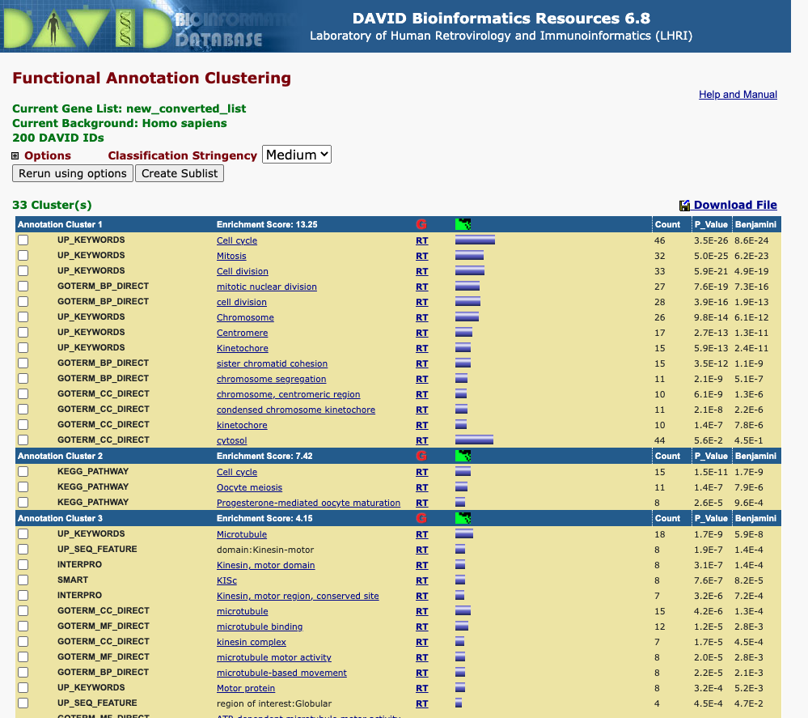

```{r}
wd = "/Users/nabibahmed/Desktop/Local Spring 2021/STAT215/Coursework/HW2"
setwd(wd)
```


## Part I: Differential expression

In this HW, we will evaluate the differentially expressed genes and pathways between breast cancer and normal breast tissues. Our collaborator generated RNA-seq on ten pairs of breast tumors and matched adjacent normal tissues, located at /n/stat115/2021/HW2/raw_data1. The experiments were run in two batches, each batch with 5 pairs of samples, and the batch information is provided in batch.csv. We have run Salmon for gene quantification which is provided in Cannon at /n/stat115/2021/HW2/raw_data1/Salmon_results. Mapping between Ensembl id and gene symbol is provides in tx2gene.csv.

### Problem I.1

Please install the following R/Bioconductor packages. Then try "library(package)" to make sure the package works. 

Note: sva package with Combat function is used for batch effect removal; 

DESeq2 package is used for differential gene expression analysis; 

tximport package is used for importing transcript-level abundance into gene-level matrices for downstream analysis

ggplot2 package is used for general plotting in R; 

pheatmap package is used for heatmap plotting;

dplyr package is used for data frame manipulations in R;

fgsea package is used for gene-set enrichment analysis.

```{r libraries, message = FALSE, cache=TRUE}
# ```{r install, eval = FALSE}
# if (!requireNamespace("BiocManager", quietly = TRUE))
#     install.packages("BiocManager")
# BiocManager::install("sva")
# BiocManager::install("DESeq2")
# BiocManager::install("tximport")
# install.packages(c("ggplot2", "dplyr",
#                    "pheatmap"))
# BiocManager::install("fgsea")
# BiocManager::install("ComplexHeatmap")
library(ggplot2)
library(sva)
library(DESeq2)
library(tximport)
library(dplyr)
library(fgsea)
library(pheatmap)
library(ComplexHeatmap)
```

```{r, cache=TRUE}
# additional libraries
library(factoextra)
library(caret)
library(readr)
library(apeglm)
library(EnhancedVolcano)
library(ComplexHeatmap)
library(purrr)
```
\textbf{Answer}: Successfully install all the package to my RStudio. I also included additional libraries.

### Problem I.2

For RNA-seq analysis, visualization using principle component analysis (PCA) or hierarchical clustering is an essential step of exploratory analysis to identify potential batch effect. Please import transcript-level TPM values from Salmon output and convert to gene-level TPM values. Perform PCA of the samples using log2 transformed TPM values. Indicate different tissues (tumor or normal, using shape to show) and batch (1 or 2, using color to show) of each sample. Next try to use hierarchical clustering for these samples.
Do the results suggest the presence of a batch effect?

For this question, you will load Salmon output at /n/stat115/2021/HW2/raw_data1/Salmon_results. You also need to read in batch information provided in /n/stat115/2021/HW2/raw_data1/batch.csv. Remember to convert Ensembl ID to gene symbol, using the mapping provided in /n/stat115/2021/HW2/raw_data1/tx2gene.csv.

\textbf{Answer}: I used scp command to transfer over the Salmon_results, batch.csv, and tx2gene.csv to my location machine. Below is my bash code (run on my location machine).

```{r, engine="bash", eval = FALSE}
# transfer Salmon_results to local directory (on local terminal)
scp -r stat215u2107@login.rc.fas.harvard.edu:/n/stat115/2021/HW2/raw_data1/Salmon_results "Q1"

# transfer batch.csv to local directory (on local terminal)
scp stat215u2107@login.rc.fas.harvard.edu:/n/stat115/2021/HW2/raw_data1/batch.csv "Q1"

# transfer tx2gene.csv to local directory (on local terminal)
scp stat215u2107@login.rc.fas.harvard.edu:/n/stat115/2021/HW2/raw_data1/tx2gene.csv "Q1"
```

I load in my data files. I use tximport which takes my Salmon results and tx2gene csv to return a simple list with matrices, "abundance", "counts", and "length", where the transcript level information is summarized to the gene-level. I also rename the columns accordingly.
```{r, cache=TRUE}
### Your code here
# read data files
batch = read.csv("Q1/batch.csv")
tx2gene = read.csv("Q1/tx2gene.csv")

# using txi to read in all transcript data
# convert transcript-level TPM to gene-level TPM values (using tximport package)
# A simple list with matrices, "abundance", "counts", and "length", is returned, where the transcript level information is summarized to the gene-level
# Source: https://bioconductor.org/packages/devel/bioc/vignettes/tximport/inst/doc/tximport.html
salmon_files = paste("Q1/Salmon_results/", batch$X, ".sf", sep="")
txi = tximport(salmon_files, type = "salmon", tx2gene = tx2gene)

# labeling columns
colnames(txi[["abundance"]]) = batch$X
colnames(txi[["counts"]]) = batch$X
colnames(txi[["length"]]) = batch$X
```
I perform a log2(TPM+2) transform on the TPM data to resolve issues with 0 values (as instructed in the prompt and slack) and negative values for comparsion in Q1.3.
```{r}
# getting the transcript-level TPM values
TPM = txi[["abundance"]]
TPM.df = data.frame(TPM)

# Taking log2(TPM+2) transformation (resolves issue with 0s and negatives)
logTPM = log2(TPM+2)
logTPM.df = data.frame(logTPM)
```

Using prcomp, I perform PCA on the logTPM values. I make the scree plot and see the first two principal components account for ~96.4% of the total variance.
```{r}
# Perform PCA of the samples using log2 transformed TPM values & making scree plot
res.pca = prcomp(logTPM.df, scale = TRUE)
pca.var.per = round(res.pca$sdev^2/sum(res.pca$sdev^2)*100,1)
fviz_eig(res.pca, addlabels=TRUE, ylim=c(0,100),
         geom=c("bar", "line"), barfill="gold",
         barcolor="grey", linecolor="red", ncp=10) +
    labs(title="PCA Coverage",
         x="Principal Components", y="% of variances")
```
Using the first two principal components, I plot my batches. I designated shape for tissue samples and color for batch.
```{r}
# making PCA graph data
pca_data = data.frame(res.pca[["rotation"]])
pca_data$X = rownames(pca_data)
pca_data = merge(batch, pca_data, by.y=c("X"))

# plot PCA graph
# shapes for tissues, colors for batch
ggplot(data=pca_data, aes(x=PC1, y=PC2, shape=tissue, color=factor(batch))) +
  xlab(paste("PC1: ",pca.var.per[1],"%",sep ="")) +
  ylab(paste("PC2: ",pca.var.per[2],"%",sep ="")) +
  geom_point(size= 7) +
  ggtitle("PCA Graph (PC1 vs PC2)")
```
From the PCA graph above, we see that for batch 1, tumor and normal tissue are on separate corners whereas for batch 2, tumor and normal tissues are in the same corner. I would expect the relationship between tumor and normal tissues to be the same between the batches - given that the two batches show different patterns, this PCA plot suggest potential batch effect.

Now let's try to use hierarchical clustering for these samples for checking for batch effects on logTPM values.
```{r}
# making and scaling logTPM values
hc.logTPM = t(logTPM)
hc.logTPM = scale(hc.logTPM)

# hierarchical clustering using euclidean
dist.hc.logTPM = dist(hc.logTPM, method = "euclidean")

# Hierarchical clustering using Complete Linkage
hc1 <- hclust(dist.hc.logTPM, method = "complete" )

# Plot the obtained dendrogram
plot(hc1, cex = 0.6, hang = -1)
```
The samples N1-5 and T1-5 are batch 2; the samples N6-10 and T6-10 are batch 1. It seems from the dendrogram, the samples of batch 2 are all clustered together despite being different tissue types - the clustering is happening per batch and not tissue type as we would expect. Again this seems odd and there appears to be potential batch effect.

```{r}
# plotting correlation heatmap
pheatmap(cor(logTPM))
```
Following up with additional analysis with the pheatmap command, I see further proof of batch effect - the samples within batch 2 are more correlated each other than tumor tissues between batches and normal tissues between batches as we should expect.


### Problem I.3

Run COMBAT on the samples to remove the batch effect. Visualize the results using a similar PCA and hierarchical clustering as Problem 2. Provide evidence that the batch effects are successfully adjusted. 

\textbf{Answer}: I ran COMBAT on TPM (as per instructions on slack). I need to filter out genes with zero variance - I used nearZeroVar function from caret.
```{r, cache=TRUE}
### Your code here
# remaking TPM dataframe
q2.TPM = txi[["abundance"]]
q2.TPM.df = data.frame(q2.TPM)

# removing zero variance rows
q2.TPM.df = q2.TPM.df[-nearZeroVar(t(q2.TPM.df)),]

# performing combat analysis
combat_dat = ComBat(q2.TPM.df, pca_data$batch, par.prior=TRUE)
```

Then I do log2(combat_dat+2) transform (to handle zero value and negatives) those results to run PCA, hierarchical clustering, and pheatmap analysis.
```{r}
# Taking log2(combat_dat+1) transformation (resolves issue with 0s and negatives)
combat.logTPM = log2(combat_dat+2)
combat.logTPM.df = data.frame(combat.logTPM)
```

Using prcomp, I perform PCA on the post ComBat logTPM values. I make the scree plot and see the first two principal components account for ~96.9% of the total variance.
```{r}
# Perform PCA of the samples using log2 transformed combat TPM values & making scree plot
res.pca = prcomp(combat.logTPM.df, scale = TRUE)
pca.var.per = round(res.pca$sdev^2/sum(res.pca$sdev^2)*100,1)
fviz_eig(res.pca, addlabels=TRUE, ylim=c(0,100),
         geom=c("bar", "line"), barfill="gold",
         barcolor="grey", linecolor="red", ncp=10) +
    labs(title="PCA Coverage",
         x="Principal Components", y="% of variances")
```
Using the first two principal components, I plot my batches post ComBat. I designated shape for tissue samples and color for batch as before.
```{r}
# making PCA graph data
pca_data = data.frame(res.pca[["rotation"]])
pca_data$X = rownames(pca_data)
pca_data = merge(batch, pca_data, by.y=c("X"))

# plot PCA graph
# shapes for tissues, colors for batch
ggplot(data=pca_data, aes(x=PC1, y=PC2, shape=tissue, color=factor(batch))) +
  xlab(paste("PC1: ",pca.var.per[1],"%",sep ="")) +
  ylab(paste("PC2: ",pca.var.per[2],"%",sep ="")) +
  geom_point(size= 7) +
  ggtitle("PCA Graph Post ComBat (PC1 vs PC2)")
```
From the PCA graph above, we see batch 1 and batch 2 appear more similar, with their tissue sample being located in the upper right corner. This PCA graph is different from the original and shows that ComBat helped to address potential batch effects as the pattern in the two batches are more a like as we should expect.

Now let's try to use hierarchical clustering for these samples for checking for batch effects on post ComBat logTPM values.
```{r}
# making and scaling logTPM values
hc.logTPM = t(combat.logTPM)
hc.logTPM = scale(hc.logTPM)

# hierarchical clustering using euclidean
dist.hc.logTPM = dist(hc.logTPM, method = "euclidean")

# Hierarchical clustering using Complete Linkage
hc1 <- hclust(dist.hc.logTPM, method = "complete" )

# Plot the obtained dendrogram
plot(hc1, cex = 0.6, hang = -1)
```
The samples N1-5 and T1-5 are batch 2; the samples N6-10 and T6-10 are batch 1. The dendrogram is more like what we should expect with clustering happening based on tissue types (tumor vs normal) as opposed to batch. We see that normal tissues cells were clustered with each other before being added to a group with tumor tissues (and vice versa for tumor tissues).

```{r}
# plotting correlation heatmap
pheatmap(cor(combat.logTPM))
```
Following up with additional analysis with the pheatmap command, I see further proof of ComBat working to address batch effect! We see that the highest correlation is between tissues of the same type - unlike in Q1.2 where the highest correlations were for tissues within batch 2.


### Problem I.4

Run DESeq2 based on paired samples adjusting for the batch effect to identify differentially-expressed genes between tumor and normal tissues. How many genes are expressed higher in tumors than normal. Let's use 1) FDR < 0.01 and 2) Log2 fold change > 1 as the cutoff. 

Note: please use the raw_count columns of the Salmon result and convert these to integer values for DESeq2.

Identify the top 5 most (by Log2FC) over expressed genes (FDR < 0.01) in tumor and normal, respectively.  

\textbf{Answer}: As per slack message, I can use the counts from txi object. For my design matrix, I specified the batch then condition (tissue). Also per slack, the FDR is the padj in res dataframe below.
```{r, cache=TRUE}
### Your code here
# converting numeric to factor for design matrix
ddsBatch = batch
ddsBatch$X = as.factor(ddsBatch$X)
ddsBatch$patient = as.factor(ddsBatch$patient)
ddsBatch$batch = as.factor(ddsBatch$batch)
ddsBatch$tissue = as.factor(ddsBatch$tissue)

# performing DESeq2 (lab 3 code)
ddsTxi = DESeqDataSetFromTximport(txi,
                                  colData = ddsBatch,
                                  design = ~ batch + tissue)
dds <- DESeq(ddsTxi)
res <- results(dds)
resultsNames(dds)
```
```{r}
# converting to data frame
res.df = data.frame(res@listData)
rownames(res.df) = res@rownames

# Filter based on criteria (1) FDR < 0.01
res.df = na.omit(res.df[res.df$padj<0.01,])

# Filter based on criteria (1) |LF2Change| > 1
res.df = na.omit(res.df[abs(res.df$log2FoldChange)>1,])

# Get top 5 and bottom 5 by Log2FC
res.df = res.df[order(res.df$log2FoldChange),]
head(res.df, 5)
tail(res.df, 5)
```
Since our condition is tissue_Tumor_vs_Normal, I assume negative log2foldchange values correspond to Tumor. Thus, the 5 most expressed gene for Tumor tissues is FABP7, UGT2B28, SOX10, SMYD1, and KRT14. For Normal tissues CASP14, TRPA1, HOXB13, CLEC3A, SLC30A8. (If I got the direction wrong, my apologize for misinterpreting).


### Problem I.5

Visualize the differential gene expression values by making a volcano and an MA plot to summarize the differences between tumor and normal. In the volcano plot, draw the statistically significant (FDR < 0.01, Log2FC > 1) tumor up-genes red and down-genes blue.

Note: Be sure to use the lfcShrink function to get more robust estimates of the fold-changes for genes.

\textbf{Answer}: Below is the MA plot and Volcano plot. For MA plot, Slack said to use default type and not to set lfcThreshold. Similarly for the volcano plot, I made the region with log2FC>1 red for tumor up-gene and region with log2FC<-1 blue for tumor down-gene.
```{r}
### Your code here
# MA Plot (from Lab 3)
resApeT = lfcShrink(dds, coef="tissue_Tumor_vs_Normal")
DESeq2::plotMA(resApeT, ylim=c(-3,3), cex=.8, main="MA Plot")
abline(h=c(-1,1), col="dodgerblue", lwd=2)
```


```{r}
# volcano plot
with(resApeT, plot(log2FoldChange, -log10(pvalue), 
                   pch=20, main="Volcano Plot"))
# adding line for Log2FC > 1
abline(v=1, lty=2); abline(v=-1, lty=2)

# adding line for FDR < 0.01
abline(h=-log10(0.01), lty=2)

# tumor up-genes red (log2FC>1)
with(subset(resApeT, padj<.01 & log2FoldChange>1), 
     points(log2FoldChange, -log10(pvalue), pch=20, col="red"))

# tumor down-genes blue (log2FC<-1)
with(subset(resApeT, padj<.01 & log2FoldChange<(-1)), 
     points(log2FoldChange, -log10(pvalue), pch=20, col="blue"))
```


### Problem I.6

Try kmeans (try k = 4 or 7) clustering to group differentially expressed genes into different clusters. How many genes are there in each cluster? Draw a heatmap showing gene clusters. 

\textbf{Answer}: From Slack: For I.6,  you should subset Combat-corrected matrix by differentially expressed genes obtained from DESeq2. I will run kmeans (and heatmap) on combat.logTPM.df (ie log-transformed COMBAT expression matrix) to handle batch effect from the genes DESeq2 said were differentially expressed.

```{r}
### Your code here
# subsetting differentially expressed genes from ComBat results
i6.data = subset(combat.logTPM.df, rownames(combat.logTPM.df) %in% rownames(res.df))

# removing NAs and scaling
i6.data = scale(na.omit(i6.data))
``` 

Trying kmeans with $k=4$. The composition of genes in the four categories are 603, 463, 608, and 354 (clusters 1-4).
```{r}
set.seed(215)
k4 = kmeans(i6.data, centers = 4, nstart = 25)
fviz_cluster(k4, data = i6.data)
table(k4$cluster)
```

Trying kmeans with $k=7$. The composition of genes in the four categories are 303, 418, 257, 255, 266, 257, and 272 (clusters 1-7).
```{r}
set.seed(215)
k7 = kmeans(i6.data, centers = 7, nstart = 25)
fviz_cluster(k7, data = i6.data)
table(k7$cluster)
```
Comparing $k=4$ and $k=7$, I would say they performed fairly similar in splitting up the groups. However, I think $k=4$ looks better and is more natural than $k=7$. The elbow graph below agrees with a more prominent bend at $k=4$ compared to $k=7$. Analyzing the elbow graph more, it seems the sharpest bend is at $k=2$ (which to me make sense since we're working with 2 types of tissue sample - tumor and normal). However since $k=7$ is the magic number, we'll stick with that!

```{r}
set.seed(215)

# function to compute total within-cluster sum of square 
wss <- function(k) {
  kmeans(i6.data, k, nstart = 25)$tot.withinss
}

# Compute and plot wss for k = 1 to k = 15
k.values <- 1:15

# extract wss for 2-15 clusters
wss_values <- map_dbl(k.values, wss)

plot(k.values, wss_values,
       type="b", pch = 19, frame = FALSE, 
       xlab="Number of clusters K",
       ylab="Total within-clusters sum of squares")
```
I drew a heatmap that is sample (x-axis) vs gene (y-axis) based on $k=7$ clusters (magic number from lecture). I remove the row titles since it was hard to read (all on top of one another). Look at the heatmap, each cluster has a distinctive pattern/trend. Furthermore, there's a visible distinction as we go from the normal samples to the tumor samples. Thus the heatmap shows a difference between tumor and normal tissues (as we'd expect).
```{r}
set.seed(215)
Heatmap(i6.data, name = "gene expression", 
        row_km = 7,
        column_title = "HeatMap",
        column_order = colnames(i6.data),
        show_row_names = FALSE)
```


### Problem I.7: For graduate students only

If you run DESeq2 without removing batch effect, how many differential genes do you get? How do their K-means clustering look? Does batch effect removal gives more interpretable results? 

\textbf{Answer}: This would be DESeq2 analysis done in I.4 without adding batch to the design component of DESeqDataSetFromTximport.
```{r}
### Your code here
# performing DESeq2 (lab 3 code)
ddsTxi.i7 = DESeqDataSetFromTximport(txi,
                                     colData = ddsBatch,
                                     design = ~ tissue)
dds.i7 <- DESeq(ddsTxi.i7)
res.i7 <- results(dds.i7)
resultsNames(dds.i7)
```
```{r}
# converting to data frame
res.df.i7 = data.frame(res.i7@listData)
rownames(res.df.i7) = res.i7@rownames

# Filter based on criteria (1) FDR < 0.01
res.df.i7 = na.omit(res.df.i7[res.df.i7$padj<0.01,])

# Filter based on criteria (1) |LF2Change| > 1
res.df.i7 = na.omit(res.df.i7[abs(res.df.i7$log2FoldChange)>1,])

nrow(res.df.i7)
```
If I ran DESeq2 without removing batch effect, I would get 1352 differential genes (compared to 2037 differential genes controlling for batch effect). 

Analyzing their kmeans for $k=4$ and $k=7$. I will subset into the original data set.
```{r}
# subsetting differentially expressed genes from ComBat results
i7.data = subset(logTPM.df, rownames(logTPM.df) %in% rownames(res.df.i7))

# removing NAs and scaling
i7.data = scale(na.omit(i7.data))
``` 

```{r}
set.seed(215)
k4.i7 = kmeans(i7.data, centers = 4, nstart = 25)
fviz_cluster(k4.i7, data = i7.data)
table(k4.i7$cluster)

k7.i7 = kmeans(i7.data, centers = 7, nstart = 25)
fviz_cluster(k7.i7, data = i7.data)
table(k7.i7$cluster)
```
The respective cluster size for $k=4$ is 306, 240, 426, and 380 . The respective cluster size for $k=7$ is 269, 175, 141, 167, 168, 205, and 227. The clusters for $k=4$ look similar, but for $k=7$, this DESeq2 analysis did worse. The purple region for example has an awkward point that touches the blue cluster - that point would be better classified in the blue cluster. Similarly, for the pink region has an awkward space and would be better to partition that cluster to neighboring clusters - maybe the bottom portion should be blue. The cluster plot in I.6 didn't have these issues.

Thus, I would say that batch effect removal gives better results as seen by the issues with the cluster plots. Better cluster plots mean more interpretable results.

```{r}
set.seed(215)
Heatmap(i7.data, name = "gene expression", 
        row_km = 7,
        column_title = "HeatMap",
        column_order = colnames(i6.data),
        show_row_names = FALSE)
```
For the heatmap, I could not make out a difference between this and the heatmap from I.6


### Problem I.8

From the batch-removed DESeq2 run results, extract the top 200 tumor-upregulated genes (by Log2FC, FDR < 0.01). Run DAVID GO analysis (http://david.abcc.ncifcrf.gov/) to see whether these genes are enriched in specific biological process (BP), pathways, etc.

\textbf{Answer}: Upregulated genes are those whose log2FoldChange > 1. We already sorted our genes by log2FoldChange in before, so let's pull the last 200 rows.
```{r}
# export the list of genes
write_tsv(data.frame(rownames(tail(res.df, 200))), 
          path = "i.8.txt")
```
Below is the enrichment table.



### Problem I.9: For graduate students only

Run Gene Set Enrichment analysis (http://www.broadinstitute.org/gsea/index.jsp) using the summary statistics from problem 4. Show the top five gene sets or pathways that best capture the differentially expressed genes between tumor than normal. Comment on the biological relevance of the results. Plot GSEA enrichment plot for an interesting pathway. 

Mapping between gene sets and pathways is provided in /n/stat115/2021/HW2/raw_data1/c2.cp.kegg.v7.1.symbols.gmt file.

\textbf{Answer}: I copied over the .gmt file via scp.
```{r, engine="bash", eval = FALSE}
# transfer mapping to local directory (on local terminal)
scp stat215u2107@login.rc.fas.harvard.edu:/n/stat115/2021/HW2/raw_data1/c2.cp.kegg.v7.1.symbols.gmt "Q1"
```

I rank out my DESeq2 data and made a plot.
```{r}
# ranking all genes in the data set
gseaDat = res.df
ranks = res.df$log2FoldChange
names(ranks) = rownames(res.df)
barplot(sort(ranks, decreasing = T))
```
I import the pathway file and correct the shape for proper GSEA analysis.
```{r}
# loading in pathways data and correcting form
pathways = read.delim("Q1/c2.cp.kegg.v7.1.symbols.gmt",
                       header = FALSE, stringsAsFactors = FALSE, quote = "", sep = "\t")
pathways = subset(pathways, select = -V2)
pathways = t(pathways)
colnames(pathways) = pathways[1,]
pathways = pathways[-1,]
pathways = data.frame(pathways)
```

I print the top five gene sets or pathways that best capture the differentially expressed genes between tumor than normal. They are KEGG_CELL_CYCLE, KEGG_RETINOL_METABOLISM, SFN, KEGG_PPAR_SIGNALING_PATHWAY, and KEGG_ECM_RECEPTOR_INTERACTION.

Using the Broad Institute website, I saw that KEGG_CELL_CYCLE is related to mitotic cell cycle progression - this make sense as tumors are irregular production in cell mitosis. I also found the other pathways KEGG_PPAR_SIGNALING_PATHWAY and KEGG_ECM_RECEPTOR_INTERACTION related to cell proliferation which again makes sense for tumor data (since tumors are related to irregular cell production).
```{r}
# running GSEA
fgseaRes <- fgsea(pathways, ranks, minSize=15, maxSize = 500, nperm=1000)
head(fgseaRes[order(padj, -abs(NES)), ], n=5)
```
I plot the GSEA enrichment plot for the KEGG_CELL_CYCLE pathway.
```{r}
plotEnrichment(pathways[["KEGG_CELL_CYCLE"]], ranks)
```


## Part II: Sample classification

We provide you z-score normalized expression data of 50 breast tumor samples, 50 normal breast samples (your training and cross-validation data), and 20 samples without diagnosis (your testing data). We want to use the 100 samples with known diagnosis to train machine learning models in order to predict the 20 unknown samples. 

You will need the following libraries in R: ggplot2 and ggfortify for plotting, MASS and caret for machine learning, and pROC is for evaluating testing performance. The YouTube video on caret (https://youtu.be/z8PRU46I3NY) and the package documentation (http://topepo.github.io/caret/index.html) might be helpful.

All data for Part II are provided at /n/stat115/2021/HW2/raw_data2.

```{r, warning=FALSE, cache=TRUE, message=FALSE}
library(ggplot2)
library(ggfortify)
library(pROC)
library(caret)
```

```{r}
# additional libraries

```


```{r, engine="bash", eval = FALSE}
# transfer data to local directory (on local terminal)
scp -r stat215u2107@login.rc.fas.harvard.edu:/n/stat115/2021/HW2/raw_data2 "Q2"
```

```{r, cache=TRUE}
# read in data
train_label = read.delim("Q2/raw_data2/BRCA_phenotype.txt",
                       header = TRUE, stringsAsFactors = FALSE, quote = "", sep = "\t")
train_data = read.delim("Q2/raw_data2/BRCA_zscore_data.txt",
                       header = TRUE, stringsAsFactors = FALSE, quote = "", sep = "\t")
test_label = read.delim("Q2/raw_data2/diagnosis.txt",
                       header = TRUE, stringsAsFactors = FALSE, quote = "", sep = "\t")
test_data = read.delim("Q2/raw_data2/unknown_samples.txt",
                       header = TRUE, stringsAsFactors = FALSE, quote = "", sep = "\t")
```

### Problem II.1

Run PCA for dimension reduction on the 100 samples with known labels, and draw these 100 samples in a 2D plot. Do cancer and normal separate from the first two PCs? Would this be sufficient to classify the unknown samples?

z-score normalized data are provided in BRCA_zscore_data.txt. Phenotype data is in BRCA_phenotype.txt.

\textbf{Answer}:
```{r, cache=TRUE}
### Your code here
res.pca = prcomp(train_data, scale = TRUE, center = TRUE)
```

### Problem II.2

Draw a plot showing the cumulative % variance captured from the top 100 PCs. How many PCs are needed to capture 90% of the variance? 

```{r}
### Your code here

```

### Problem II.3

Apply machine learning methods (KNN, logistic regression, Ridge regression, LASSO, ElasticNet, random forest, and support vector machines) on the top 25 PCs of the training data and 5-fold cross validation to classify the samples. caret and MASS already implemented all of the machine learning methods, including cross-validation, so calling each is only one command. In order to get consistent results from different runs, use set.seed(). 

```{r}
### Your code here

```

### Problem II.4

Summarize the performance of each machine learning method, in terms of accuracy and kappa. 

```{r}
### Your code here

```

### Problem II.5: For Graduate students only

Compare the performance difference between logistic regression, Ridge, LASSO, and ElasticNet. In LASSO, how many PCs have non-zero coefficient? In ElasticNet, what is the lamda for Ridge and LASSO, respectively? 

```{r}
### Your code here

```

### Problem II.6

Use the PCA projections in Q1 to obtain the first 25 PCs of the 20 unknown samples. Use one method that performs well in Q4 to make predictions. Caret already used the hyper-parameters learned from cross-validation to train the parameters of each method on the full 100 training data. You just need to call this method to make the predictions. 

Expression data for the 20 unknown samples are provided in unknown_samples.txt.

```{r}
### Your code here

```

### Problem II.7: For Graduate students only

Can you find out the top 3 genes that are most important in this prediction method in Q6? Do they have some known cancer relevance? 

```{r}
### Your code here

```

### Problem II.8

Suppose a pathologist later made diagnosis on the 20 unknown samples (load the diagnosis.txt file). Based on this gold standard, draw an ROC curve of your predictions in Q6. What is the prediction AUC? 

```{r}
### Your code here

```