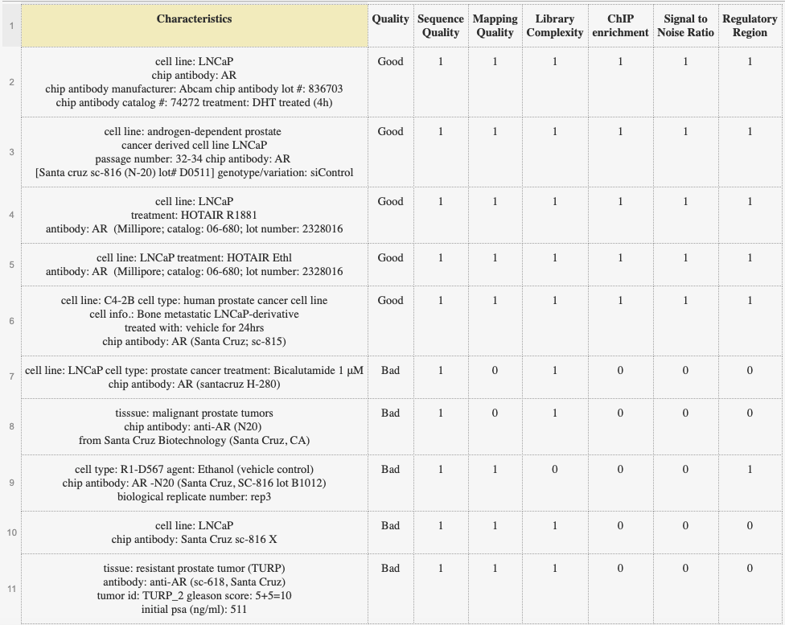

```{r, echo=FALSE}
# setting work directory
dir = "/Users/nabibahmed/Desktop/Local Spring 2021/STAT215/Coursework/HW3"
setwd(dir)
```

# Motifs, ChIP-seq, and Gene Expression Integration

**Androgen receptor (AR) is a transcription factor frequently over-activated in prostate cancer. To study AR regulation in prostate cancer, scientists conducted AR ChIP-seq in prostate tumors and normal prostate tissues. Since the difference between individual patients could be quite big, this study actually included many more tumor and normal samples. However, for the purpose of this HW, we will only use the ChIP-seq data from 1 prostate tumor samples (tumor) and 1 normal prostate tissues (normal). **

Hint: It helps to read the MACS README and Nature Protocol paper:  
https://pypi.org/project/MACS2/  
https://www.nature.com/articles/nprot.2012.101  

## Part I. ChIP-seq peak calling

### Question 1
**Usually we use BWA to map the reads to the genome for ChIP-seq experiment. We will give you one example ChIP-seq single-end sequenced .fastq file with only 1M reads. Run BWA on this file to Hg38 of the human genome assembly. Report the commands, logs files, and a snapshot / screen shot of the output to demonstrate your alignment procedure. What proportion of the reads are successfully mapped (to find at least one location) and what proportions are uniquely mapped (to find a single location) in the human genome in this test sample? We will save you some time and directly give you the BWA mapped BAM files for the full samples. **

Hint:  
1). Target sample fastq file is stored as **/n/stat115/2021/HW3/tumor_1M.fastq** on Cannon.  
2). The index file is stored as **/n/stat115/2021/HW3/bwa_hg38_index/hg38.fasta** on Cannon. Throughout this HW, all the coordinates are given in Hg38 version of the human genome assembly. 

\textbf{Answer}: I use Lab 5 for reference for bash commands. I also provide screen shots of my BWA output and analysis using samtools.

```{r, engine='bash', eval=FALSE}
# your bash code here
# transitioning from the login node to the computing node
srun --nodes=1 --ntasks-per-node=1 --mem=64G --cpus-per-task=8 --time=10:00:00 --pty bash -i

# make work directory
mkdir HW3/Q1

# loading bwa module
module load bwa/0.7.15-fasrc02

# bwa analysis
bwa mem /n/stat115/2021/HW3/bwa_hg38_index/hg38.fasta /n/stat115/2021/HW3/tumor_1M.fastq > HW3/Q1/tumor.sam

# loading samtools module to acquire the summary statistics
module load samtools/1.5-fasrc02

# check the number of total reads and successfully mapped reads
samtools flagstat HW3/Q1/tumor.sam

# create a bam file of uniquely mapped reads
samtools view -bq 1 HW3/Q1/tumor.sam > HW3/Q1/tumor_unique.bam

# check the unique bam file to find the number of uniquely mapped reads
samtools flagstat HW3/Q1/tumor_unique.bam
```

Below is the screen shot of the bwa command. According Jiazhen on Slack: "If you directly type the commands, then the outputs will be printed as text on terminal instead of being saved in .out & .err. You can take a screen shot of those text output as well." Since I'm writing commands directly, I provide terminal output.

Below is the screen shot of the flagstat (number of total reads and successfully mapped reads). From this, we conclude that the proportion of the reads that are successfully mapped is XXXX.


Below is the screen shot of the flagstat (number of uniquely mapped reads). From this, we conclude that the proportion of the reads that are successfully mapped is XXXX.


### Question 2 **For Graduate Students Only**
**In ChIP-seq experiments, when sequencing library preparation involves a PCR amplification step, it is common to observe multiple reads where identical nucleotide sequences are disproportionately represented in the final results. This is especially a problem in tissue ChIP-seq experiments (as compared to cell lines) when input cell numbers are low. Duplicated read % is sometimes a good way to QC your ChIP-seq sample, as high duplicated reads indicate PCR over amplification of the ChIP DNA. Removing these duplicated reads can improve the peak calling accuracy. Thus, it may be necessary to perform a duplicate read removal step, which flags identical reads and subsequently removes them from the dataset. Run this on your test sample (1M reads) (macs2 filterdup function). What % of reads are redundant? Note: when doing peak calling, MACS filters duplicated reads by default. **

Hint:
The test samples are stored as **/n/stat115/2021/HW3/tumor.bam** and **/n/stat115/2021/HW3/normal.bam** on Cannon.

\textbf{Answer}: I use Lab 5 for reference for bash commands (using macs2 with keep-dup 1). I write commands directly so I will see the % of reads that are redundant on the terminal console. According to the clarification made by TF Jiazhen, "we are using the file listed in the question's (hint)" and not the file from Q1. I found the % of reads are redundant for tumor sample to be 17% and for normal samples to be 12%.

```{r, engine='bash', eval=FALSE}
# your bash code here
# make work directory
mkdir HW3/Q2

# loading in relevant modules
module load centos6/0.0.1-fasrc01
module load macs2/2.1.2_dev-fasrc01

# tumor
macs2 filterdup -i /n/stat115/2021/HW3/tumor.bam -g hs --keep-dup 1 -o HW3/Q2/tumorNoRedunant.bed

# normal
macs2 filterdup -i /n/stat115/2021/HW3/normal.bam -g hs --keep-dup 1 -o HW3/Q2/normalNoRedunant.bed
```

Below is the screen shot is the macs2 process with % of reads are redundant for tumor samples. It is 17%.


Below is the screen shot is the macs2 process with % of reads are redundant for normal samples. It is 12%.


### Question 3
**For many ChIP-seq experiments, usually chromatin input without enriching for the factor of interest is generated as control. However, in this experiment, we only have ChIP (of both tumor and normal) and no control samples. Without control, MACS2 will use the non-peak read signals around the peaks to infer the chromatin background and estimate the ChIP enrichment over background. In ChIP-seq, + strand reads and – strand reads are distributed to the left and right of the binding site, respectively, and the distance between the + strand reads and – strand reads can be used to estimate the fragment length from sonication (note: with PE seq, insert size could be directly estimated). Use MACS2 to call peaks from tumor1 and normal1 separately. How many peaks do you get from each condition with FDR < 0.05 and fold change > 5? What is the estimated fragment size in each?**

\textbf{Answer}: I use Lab 5 for reference for bash commands. I perform analysis on the bed files from Q2 (as per slack instruction). I got 28504 peaks for tumor samples and 11807 peaks for normal samples using `wc -l` on the resulting xls file.  The estimated fragment size for tumor samples is XXX and for normal samples is XXX. 

```{r, engine='bash', eval=FALSE}
# your bash code here
# make work directory
mkdir HW3/Q3

# loading in relevant modules
module load centos6/0.0.1-fasrc01
module load macs2/2.1.2_dev-fasrc01

# tumor 
macs2 callpeak -t HW3/Q2/tumorNoRedunant.bed -f AUTO -g hs -q 0.05 --fe-cutoff 5 --outdir HW3/Q3 -n tumor

# normal
macs2 callpeak -t HW3/Q2/normalNoRedunant.bed -f AUTO -g hs -q 0.05 --fe-cutoff 5 --outdir HW3/Q3 -n normal

# getting peak numbers
wc -l HW3/Q3/tumor_peaks.xls        # 28504 peaks
wc -l HW3/Q3/normal_peaks.xls       # 11807 peaks

```

Below is the screen shot of macs2 results for tumor samples.


Below is the screen shot of macs2 results for normal samples.


### Question 4
**Now we want to see whether AR has differential binding sites between prostate tumors and normal prostates. MACS2 does have a function to call differential peaks between conditions, but requires both conditions to have input control. Since we don’t have input controls for these AR ChIP-seq, we will just run the AR tumor ChIP-seq over the AR normal ChIP-seq (pretend the latter to be input control) to find differential peaks. How many peaks do you get with FDR < 0.01 and fold change > 6? **


\textbf{Answer}: I use Lab 5 for reference for bash commands. As per lab, I will use normal sample as control. I perform analysis on the bed files from Q2 (as per slack instruction). There were 10156 peaks, found using `wc -l` on the resulting xls file.

```{r, engine='bash', eval=FALSE}
# your bash code here
# make work directory
mkdir HW3/Q4

# loading in relevant modules
module load centos6/0.0.1-fasrc01
module load macs2/2.1.2_dev-fasrc01

# macs2 analysis (treatment: tumor) (control: normal)
macs2 callpeak -t HW3/Q2/tumorNoRedunant.bed -c HW3/Q2/normalNoRedunant.bed -f AUTO -g hs -q 0.01 --fe-cutoff 6 --outdir HW3/Q4 -n q4 

# getting peak numbers
wc -l HW3/Q4/q4_peaks.xls        # 10156 peaks
```

Below is the screen shot of macs2 results for Q4.


## Part II. ChIP-seq quality control

### Question 5
**Cistrome Data Browser (http://cistrome.org/db/) has collected and pre-processed a large compendium of the published ChIP-seq data in the public. Play with Cistrome DB. Biological sources indicate whether the ChIP-seq is generated from a cell line (e.g. VCaP, LNCaP, PC3, C4-2) or a tissue (Prostate). Are there over 100 AR ChIP-seq samples which passed all QC meatures in human prostate tissues? ** 

Hint: Check out Options next to the Search function. 

\textbf{Answer}: Yes, there are over 100 AR ChIP-seq samples which passed all QC measures in human prostate tissues.

Below is the screen shot of cistrome database with species set to homo sapeins, biological sources set to prostate, factors set to AR, and subset set to samples passing all quality control. There were 9 pages of results, with each page have 20 samples; thus we're clearly over 100 AR ChIP-seq samples that pass all QC measures.


### Question 6
**Doing transcription factor ChIP-seq in tissues could be a tricky experiment, so sometimes even published data in high profile journals have bad quality. Look at a few AR ChIP-seq samples in the prostate tissue on Cistrome and inspect their QC reports. Can you comment on what QC measures tell you whether a ChIP-seq is of good or bad quality? Include a screen shot of a good AR ChIP-seq vs a bad AR ChIP-seq. **

\textbf{Answer}: There are six measures of quality control on Cistrome. I found the documentation for quality metrics here (http://cistrome.org/chilin/_downloads/instructions.pdf)
1. Sequence Quality: Raw sequence median quality score and raw read GC contents. The method is via FastQC software. A good sequence quality score is $\geq 25$.
2. Mapping Quality: Uniquely mapped ratio. It aligns reads onto user-specified genomes. Then, it filters the SAM files. The uniquely mapped RATIO is the uniquely mapped reads divided by the total reads. A good uniquely mapped ratio is $\geq 60%$.
3. Library Complexity: PCR bottleneck coefficient (PBC). A good PBC score is $\geq 80%$.
4. ChIP enrichment: Sufficient number of peaks (above 500) with good enrichment (10 fold change). This depends on experiement.
5. Signal to Noise Ratio: Fraction of reads in peaks (FRiP). A good FRiP score is $\geq 1%$.
6. Regulatory Region: DNase-seq union hypersensitive sites' (DHS) overlapped ratio in top 5000 peaks. This is expected to be $\geq 70%$.

Browsing several pages of results, I noticed that quality condition #1 (Sequence Quality) and #6 (Regulatory Region) are usually satisfied. Thus, I imagine these are the baseline quality metrics and that we've gotten good at meeting these standards. I would expect at bare minimum for samples to pass these metrics before using them for research.

The other four quality conditions are usually the metrics that get flagged red. I imagine they may be more difficult to attain in samples as often. Hence I would treat samples that met most of these four to be of high quality. 

As an aside, something surprising I noticed is that quality condition #2 (Mapping Quality) was often flagged as not met even though it aligns based on user-specified genomes - this means that researchers are being honest about their data even if it means that they don't pass that quality control (demonstrates academic integrity).

Below is a screen shot of Cistrome with varies quality controls met.


Below is the screen shot of Cistrome database with a good quality.

Below is the screen shot of Cistrome database with a bad quality.


Something I noticed is that good sources often were part of very narrow research questions. The good quality example was looking specific at one pioneer factor GATA2 whereas the bad quality example was looking many things, androgen receptors, polycomb, and TMPRSS2-ERG gene fusion. Perhaps too much breadth might reduce deliberate labwork, and produce lower quality (Caveat: I know very little bio so I may misinterpreting the citation sentence).


### Question 7 **For Graduate Students Only**
**Antibody is one important factor influencing the quality of a ChIP-seq experiment. Click on the GEO (GSM) ID of some good quality vs bad quality ChIP-seq data, and see where they got their AR antibodies. If you plan to do an AR ChIP-seq experiment, which company and catalog # would you use to order the AR antibody? **

\textbf{Answer}: I compiled a small table of 10 examples and their characteristics (I visited more but I didn't want to cram too much into the table). Something I noticed was that all the bad samples were from Santa Cruz Biotechnology. However there were also good samples made from them too - thus I would deem Santa Cruz Biotechnology as not always reliable. The other two companies I saw were Abcam and Millipore - I only found examples were they passed all the quality control metrics (randomly clicked 3-4 samples from 10 pages of results). Thus I would prefer to order from those two. (Caveat: I realized in my analysis that many of the examples were from Santa Cruz [I assume it because it's cheaper], so my results on Abcam and Millipore maybe limited since I saw fewer examples of them).

In terms of catalog numbers, it seems that Millipore catalog number 06-680 and Abcam catalog number 74272 are ideal sources for AR ChIP-seq experiment.



Below is the screen shot of characteristics from a good quality example.


Below is the screen shot of characteristics from a bad quality example.


## Part III ChIP-seq motif finding

### Question 8 **For Graduate Students Only**
**We want to see in prostate tumors, which other transcription factors (TF) might be collaborating with AR. You can try any of the following motif finding tools to find TF motifs enriched in the differential AR peaks you identified above. Did you find the known AR motif, and motifs of other factors that might interact with AR in prostate cancer in gene regulation? Describe the tool you used, what you did, and what you found. Note that finding the correct AR motif is usually an important criterion for AR ChIP-seq QC as well. **

HOMER: http://homer.ucsd.edu/homer/motif/   
MEME: http://meme-suite.org/tools/meme-chip   
Weeder: http://159.149.160.88/pscan_chip_dev/   
Cistrome: http://cistrome.org/ap/root (Register a free account).  

\textbf{Answer}: I used Weeder for this problem. For Weeder, I need the bed file from my analysis in Q4 (verified on Slack); thus I `scp` the q4_summits.bed to my local machine for upload onto Weeder. I kept the default settings but changed assembly to `hg38`. The output list already ranked by the global $p$-value (the higher it is, the more enriched it is).

```{r, engine='bash', eval=FALSE}
# transfer mapping to local directory (on local terminal)
scp stat215u2107@login.rc.fas.harvard.edu:HW3/Q4/q4_summits.bed "q4_summits.bed"
```

Below is screen shot of my Weeder results.


### Question 9
**Look at the AR binding distribution in Cistrome DB from a few good AR ChIP-seq data in prostate. Does AR bind mostly in the gene promoters, exons, introns, or intergenic regions? Also, look at the QC motifs to see what motifs are enriched in the ChIP-seq peaks. Do you see similar motifs here as those you found in your motif analyses? **

your answer
```{r, engine='bash', eval=FALSE}
#Answer

#Insert the screenshot

```
## Part IV. Identify AR-interacting transcription factors

### Question 10 **For Graduate Students Only**
**Sometimes members of the same transcription factor family (e.g. E2F1, 2, 3, 4, 5, etc) have similar binding motifs, significant overlapping binding sites (but they might be expressed in very different tissues), and related functions (they could also have different functions if they interact with different partners or compete for binding to the same sites in the same cell). Therefore, to confirm that we have found the correct TFs interacting with AR in prostate tumors, in addition to looking for motifs enriched in the AR ChIP-seq, we also want to see whether the TFs are highly expressed in prostate tumor. For this, we will use the Exploration Component on TIMER (http://timer.cistrome.org/) or GEPIA (http://gepia2.cancer-pku.cn/#general). First, look at differential expression of genes in tumors. Based on the top non-AR motifs you found before, see which member of the TF family that recognizes the motif is highly expressed in prostate tissues or tumors. Another way is to see whether the TF family member and AR have correlated expression pattern in prostate tumors. Enter AR as your interested gene and another gene which is the potential AR collaborator based on the motif, and see whether the candidate TF is correlated with AR in prostate tumors. Based on the motif and expression evidences, which factor in each motif family is the most likely collaborator of AR in prostate cancer? **

Note: When we conduct RNA-seq on prostate tumors, each tumor might contain cancer cells, normal prostate epithelia cells, stromal fibroblasts, and other immune cells. Therefore, genes that are highly expressed in cancer cells (including AR) could be correlated in different tumors simply due to the tumor purity bias. Therefore, when looking for genes correlated with AR just in the prostate cancer cells, we should correct this tumor purity bias. 

your answer
```{r, engine='bash', eval=FALSE}
#Answer

#Insert the screenshot

```

### Question 11 
**Besides looking for motif enrichment, another way to find TFs that might interact with AR is to see whether there are other TF ChIP-seq data which have significant overlap with AR ChIP-seq. Take the differential AR ChIP-seq peaks (in .bed format) between tumor / normal, and run this on the Cistrome Toolkit (http://dbtoolkit.cistrome.org/). The third function in Cistrome Toolkit looks through all the ChIP-seq data in CistromeDB to find ones with significant overlap with your peak list. You should see AR enriched in the results (since your input is a list of AR ChIP-seq peaks after all). What other factors did you see enriched? Do they agree with your motif analyses before? **

your answer
```{r, engine='bash', eval=FALSE}
#Answer
#Insert the screenshot

```


## PART V. Find TF direct target genes and pathways

### Question 12 **For Graduate Students Only**
**Now we try to see what direct target genes these AR binding sites regulate. Among the differentially expressed genes in prostate cancer, only a subset might be directly regulated by AR binding. In addition, among all the genes with nearby AR binding, only a subset might be differentially expressed. One simple way of getting the AR target genes is to look at which genes have AR binding in its promoters. Write a python program that takes two input files: 1) the AR differential ChIP-seq peaks in tumor over normal; 2) refGene annotation. The program outputs to a file containing genes that have AR ChIP-seq peak (in this case, stronger peak in tumor) within 2KB +/- from the transcription start site (TSS) of each gene. How many putative AR target genes in prostate cancer do you get using this approach? **

Note: From UCSC (http://hgdownload.soe.ucsc.edu/goldenPath/hg38/database/), download the human RefSeq annotation table (find the file refGene.txt.gz for Hg38). To understand the columns in this file, check the query annotation at http://hgdownload.soe.ucsc.edu/goldenPath/hg38/database/refGene.sql. 

Hint: 
1) The RefGene annotation table is already in **/n/stat115/2021/HW3/refGene.txt** in Cannon.
2) TSS is different for genes on positive or negative strand, i.e. TSS is “txStart” for genes on the positive strand, “txEnd” for genes in negative strand. When testing your python code, try smaller number of gene annotations or smaller number of peaks to check your results before moving forward. 
3) Instead of writing the whole process in Python code (which might take a long time to run), you can rewrite TSS starting positions of refGene based on strand in Python, and then perform the 2KB +/- check by command line tool BEDTools (https://bedtools.readthedocs.io/en/latest/) . 
your answer
```{python engine='python', eval=FALSE}
#paste your code here
    
#Answer

```

### Question 13 **For Graduate Students Only**
**Now overlap the putative AR target genes you get from above with up regulated genes in prostate cances. Try to run GO (e.g. DAVID, you can try other ones too) analysis on 1) the AR target genes from binding alone and 2) the AR target genes by overlapping AR binding with differential expression. Are there enriched GO terms or pathways? **

Hint: We have pre-computed the up-regulated genes by comparing a large number of protate tumors with normal prostates, and the results are in **/n/stat115/2021/HW3/up_regulated_genes_in_prostate_cancer.txt** in Cannon.

your answer
```{r, engine='bash', eval=FALSE}
#paste your python code here

#Answer
#Insert the screenshot
```

### Question 14
**Another way of getting the AR target genes is to consider the number of AR binding sites within 100KB of TSS, but weight each binding site by an exponential decay of its distance to the gene TSS (i.e. peaks closer to TSS have higher weights). For this, we have calculated regulatory potential score for each refseq gene. Select the top 1500 genes with highest regulatory potential score, try to run GO analysis both with and without differential expression (overlap with the up-regulated genes), and see the enriched GO terms. **

Hints: 
1). We have pre-computed the regulatory potential for each gene based on the differential AR peaks and put this in **/n/stat115/2021/HW3/AR_peaks_regulatory_potential.txt** in Cannon.
2) Basically this approach assumes that there are stronger AR targets (e.g. those genes with many AR binding sites within 100KB and have stronger differential expression) and weaker AR targets, instead of a binary Yes / No AR targets. 

your answer

```{r, engine='bash', eval=FALSE}
#Code

#Answer
#Insert the screenshot
```

### Question 15 **For Graduate Students Only**
**Comment on the AR targets you get from promoter binding (your code) and distance weighted binding. Which one gives you better function / pathway enrichment? Does considering differential expression help? **

your answer
```{r, engine='bash', eval=FALSE}
#Answer

```

### Question 16
**For what you did in Q12-15, Cistrome-GO (http://go.cistrome.org/) already provides a very simple solution. It performs functional enrichment analysis using a ChIP-seq peak file and an optional differential expression analysis file. Without differential expression, Cistrome-GO will perform GO analysis only on the regulatory potential. Now, use the differential peaks and upregulated genes to run Cistrome-GO and see the enriched biological functions or pathways. **

Hint:  Please refer to https://academic.oup.com/nar/article/47/W1/W206/5485528

your answer
```{r, engine='bash', eval=FALSE}
#Answer
#Insert the screenshot
```

## PART VI. ATAC-seq

**ATAC-seq, or Assay for Transposase-Accessible Chromatin coupled with next-gen sequencing, is a technique to characterize accessible chromatin regions in the genome. Suppose the molecular mechanism of prostate cancer development was poorly understood and we didn't know AR was important, then we would not know to do AR ChIP-seq to start with. In this case, ATAC-seq oculd be performed on the prostate cancer tissue without prior knowledge, and we could find the cancer drivers based on the ATAC-seq peaks. **

**Unlike ChIP-seq which often uses chromatin input as controls, ATAC-seq has no control samples. MACS2 is  suited for calling differential ATAC-seq peaks between tumor and normal (similar to your AR differential peak calling in Q4). A second way is to first call the union peaks by combining reads from all the tumor and normal samples, the extract the read counts from each samples in the union peaks, and run DESeq2 to find differential peaks (as if each union peak is a gene in regular DESeq2 analysis). A third way is to call peaks in the tumor, then call peaks in the normal, and just simply do an overlap of the peaks between the two to find different peaks. SAMTools (http://samtools.sourceforge.net/) and BEDTools (https://bedtools.readthedocs.io/en/latest/) are extremely useful tools to manipulate SAM/BAM and BED files. **

### Question 18
**We have found some published ATAC-seq data on prostate tumor and normal prostate tissues, and have done read mapping and the peak calls (MACS2) on each data seaprately. Use BEDTools to find peaks that are unique in the tumor and not in the normal (the 3rd approach). How many tumor-specific peaks (peaks in tumor but not in normal) do you get this way? Run this through Cistrome Toolkit and examine the results. What transcription fators are important in driving these prostate cancer-specific signals?**

Hint: The peak files are **/n/stat115/2021/HW3/tumor_ATAC_peaks.bed** and **/n/stat115/2021/HW3/normal_ATAC_peaks.bed** in Cannon

your answer
```{r, engine='bash', eval=FALSE}
#Answer
#Insert the screenshot
```

### Question 19 **For Graduate Students Only**

**Now just take the top 10K ATAC-seq peaks (ranked by fold-change since these are all significant peaks already) in the prostate tumor only (not the differential peaks) and run Cistrome Toolkit. Compare the results with Q18. Can you comment on which approach gives you more meaning results?**

your answer
```{r, engine='bash', eval=FALSE}
#Answer

#Insert the screenshot

```

### Question 20
**Sometimes even without ATAC-seq, we can predict the driving transcription factors based on deferentially expressed genes by using public ChIP-seq data. Even if the public TF ChIP-seq data was generated on different cells, they still provide some insights on the TF putative targets. Based on the differential gene expression list, Lisa first tries to build an epigenetic model using public ChIP-seq and chromatin accessibility profiles, then uses public ChIP-seq data to see which TF ChIP-seq fits the chromatin model the best. Now run the up-regulated gene in prostate cancer on Lisa, and see what transcription factors were predicted as putative drivers for these differential genes? **

Hint: 
1). Please refer to https://genomebiology.biomedcentral.com/articles/10.1186/s13059-020-1934-6.
2). You can use Lisa on http://lisa.cistrome.org/, but it was not designed for a hundred students to submit jobs in one day. We have a newer command line version Lisa2 (https://github.com/liulab-dfci/lisa2), which is installed on Cannon and might save you time from waiting for the web server (actually Lisa2 also runs much faster). 

your answer
```{r, engine='bash', eval=FALSE}
#Command line

#Figure

#Answer

```

## Summary: With HW3, we hope you can see the value of TF motif, TF ChIP-seq, and chromatin accessibility profiles in understanding gene regulation or differential gene expression. We also hope you to appreciate the value of using publicly available data and integration resources in Cistrome to inform your own research explorations. 

## Part VII: Bonus question

In this course, we could not provide the full answers to HW questions after grading. This is because it is extremely time consuming to find public data which allow students to use all public tools / programs to touch on all the knowledge points in a module and get all the desirable results. As a result, we could only update some of the questions every year, and reuse many questions / data from before.   

This year, we are asking students to help us make HW questions for next year. These are completely optional. You will be given a maximum of 5 points, if your contribution is selected for future HW. Since this is a bonus question, we ask students to demonstrate your own initiative and independence, so unfortunately the TAs won't be able to help much. 

### Bonus Q1: 

For batch effect removal, we used to have a perfect example from expression microarrays. With and without batch effect, the clustering, differential expression, and GO analysis give completely different results, also batch effect removal greatly improved the results. Unfortunately with microarray topic removed from the class, we haven't been able to find a good (and simple) RNA-seq example for Part I of HW2. In 2020, the batch effect was very complicated, so students had too much trouble. This year, after testing many public datasets without success, we finally decided to simulate the RNA-seq data used in HW2 Part 1 by artificially adding batch effect to half of the samples. You might have noticed that with or without batch effect removal, even though PCA and clustering look different, the GO analysis give quite similar results. Therefore, we are asking whether you could find a better dataset for HW2 Part I, to show case batch effect removal, differential expression, clustering (H-cluster, K-means, and PCA), GO, and GESA. We hope you could provide the data, code, as well as the answers to all the questions in HW2 Part I. 

### Bonus Q2: 

There are different machine learning packages available in the public. Caret is an R version which you used in Part II of HW2. Sklearn is a python package for machine learning. For this bonus question, we ask you to rewrite the Part II of HW2, with your Sklearn solution. You might also need pandas and numpy python packages, and some R plotting functions. 
