# Part I. Chromatin Modification (3.5/5 pts)

DNA methylation patterns are altered in many diseases, including cancer, which makes this epigenetic mark an attractive target for various studies. Genome-wide detection of 5mC by bisulfite sequencing is regarded as the current gold standard for DNA methylation detection. In the HW3, we have performed the gene regulation analysis on prostate cancer using transcription factor ChIP-seq data. To better understand the effect of methylation on gene expression, we can utilize BS-seq to detect the DNA methylation positions in the genome.


**I.1 (3.5 pts) Reduced-representation bisulfite sequencing (RRBS-Seq) is a technique that uses one or multiple restriction enzymes on the genomic DNA to produce sequence-specific fragmentation. The fragmented genomic DNA is then treated with bisulfite and sequenced. RRBS-Seq is particularly effective on the sites with high methylation, such as in promoters and repeat regions. Given a subsampled RRBS-seq file(`data/bs_subreads.fastq`) in a prostate cancer cell line (LNCaP),  perform the reads mapping with bismarker(https://github.com/FelixKrueger/Bismark/tree/master/Docs). In this subsampled file, how many reads are unaligned and how many CpGs, CHGs, and CHHs are methylated?**

<u>**Instructions:**</u>

1. (0.5 pt) Make your own working directory in your local home folder. Download bismarker and 'install' it https://github.com/FelixKrueger/Bismark#installation. Note that the latest version is written in perl language, so execute the program by either `/absolute/path/to/the/bismark-*/file` or `perl bismark-*` under the corresponding folder.

**Answer**: Used lab instructions found here: [Link](https://github.com/stat115/Lab_2021/blob/main/Lab07/How%20to%20install%20Bismark.pdf).

``` {bash eval=FALSE}
# YOUR BASH SCRIPTS HERE
# setup environment
module load bowtie2/2.3.2-fasrc02 hisat2/2.1.0-fasrc01  samtools/1.5-fasrc02

# moving into dedicated HW4 file on server
mkdir HW4
cd HW4

# get Bismark release files
wget https://github.com/FelixKrueger/Bismark/archive/refs/tags/0.23.0.zip

# unzip files
unzip 0.23.0.zip
```


2.  Prepare the genome for Bismark. You can start by copying the hg38 from `/n/stat115/2021/HW1/index/hg38_raw/` to your local machine and build from there (1.5 pt graduate students only). One of the main jobs is to conduct the C-T or G-A conversion. Why are we doing this? (0.5 pt, all students)

**Answer**: First I copy the `hg38` to my local directory. Then I set up cluster computing node. Then I use `bismark_genome_preparation` from Bismark to prepare the genome using documentation from [here](https://github.com/FelixKrueger/Bismark/tree/master/Docs). The reason for conducting the C-T and G-A conversion is because it provides an appropriate reference genome. The reason for this section (Part I) is because when we do this analysis on a sample, we change the sequence so using the standard human genome wouldn't work when we go to do alignment - in this part, we resolve this issue by making a conversion of our background genome so we have something to do our mapping/realignment. This helps with our goal of identifying the regions that are protected by methylation - this lets know where the methylation events are.

```{bash eval=FALSE}
# YOUR BASH SCRIPTS HERE
# copy the hg38 file
cp -r /n/stat115/2021/HW1/index/hg38_raw/ HW4/Q2/

# transitioning from the login node to the computing node
srun --nodes=1 --ntasks-per-node=1 --mem=64G --cpus-per-task=8 --time=06:00:00 --pty bash -i

# run bismark_genome_preparation
../Bismark-0.23.0/bismark_genome_preparation hg38_raw
```


Attached is the output on the console from `bismark_genome_preparation`

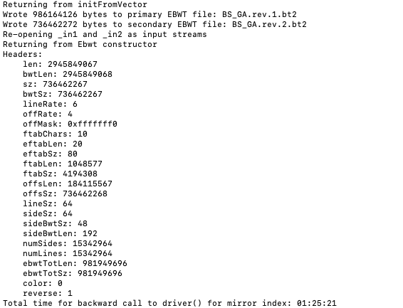


3. (1 pt) Now that we prepared the genome for the question, follow the Bismark docs to run the main bismark functions, then deduplicate and extract the methylations. For undergraduate students, use directly the converted genome `/n/stat115/2021/HW4/p1_data/hg38/` or here `/n/home13/stat115u2102/hw4/setup/hg38_p1/`. What do you see from `perl bismark2report`?

**Answer**: I follow the documentation provided in the slide. As per TA Jiazhen Rong's Slack message responding to whether graduate students can use the converted genome: "Yes you definitely could use the pre-converted genome since I.1.3. But still need to report some important lines of I.1.2's log message after bismark converting step finishes running," I will use the pre-converted genome for this question due to the time needed for I.1.2 to complete. 

``` {bash eval=FALSE}
# YOUR BASH SCRIPTS HERE
# running bismark
perl ../Bismark-0.23.0/bismark --genome /n/stat115/2021/HW4/p1_data/hg38/ /n/stat115/2021/HW4/p1_data/bs_subreads.fastq

# running deduplicate
perl ../Bismark-0.23.0/deduplicate_bismark --bam bs_subreads_bismark_bt2.bam

# extract the methylations
perl ../Bismark-0.23.0/bismark_methylation_extractor --gzip --bedGraph bs_subreads_bismark_bt2.deduplicated.bam

# generating report
perl ../Bismark-0.23.0/bismark2report

# print outputs
cat bs_subreads_bismark_bt2_SE_report.txt
cat bs_subreads_bismark_bt2.deduplication_report.txt

# moving generated HTML to local drive
scp stat215u2107@login.rc.fas.harvard.edu:HW4/Q3/bs_subreads_bismark_bt2_SE_report.html "QI.1.3/report.html"
```


From the bismark2report, I get the following `bs_subreads_bismark_bt2_SE_report.txt`, `bs_subreads_bismark_bt2.deduplication_report.txt`, and generated HTML output. As per Bo Yuan's Slack message, I attach screen shots of my results.

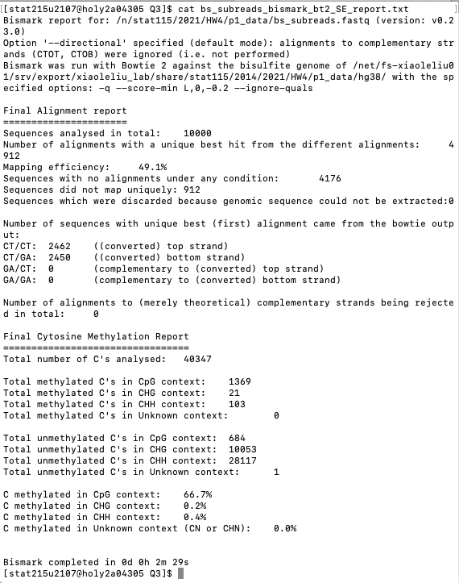


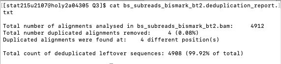


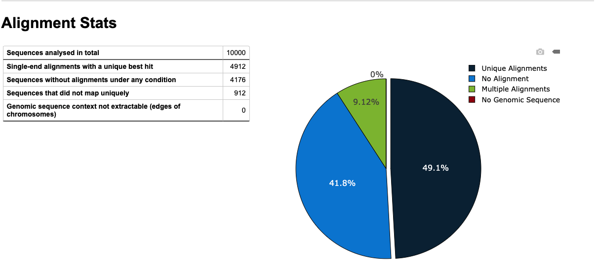


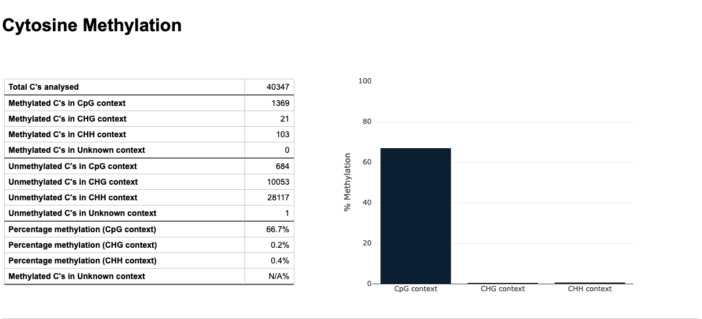


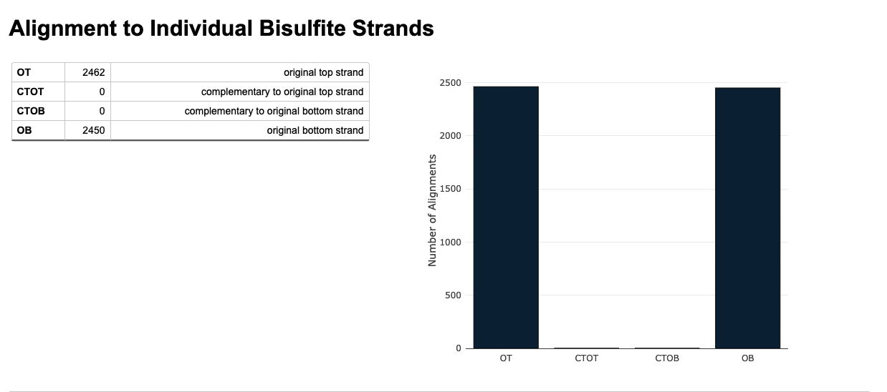


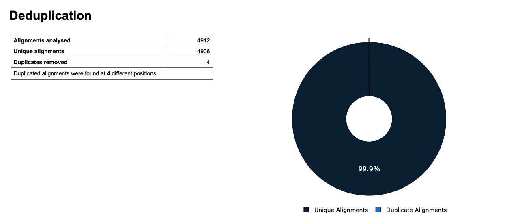


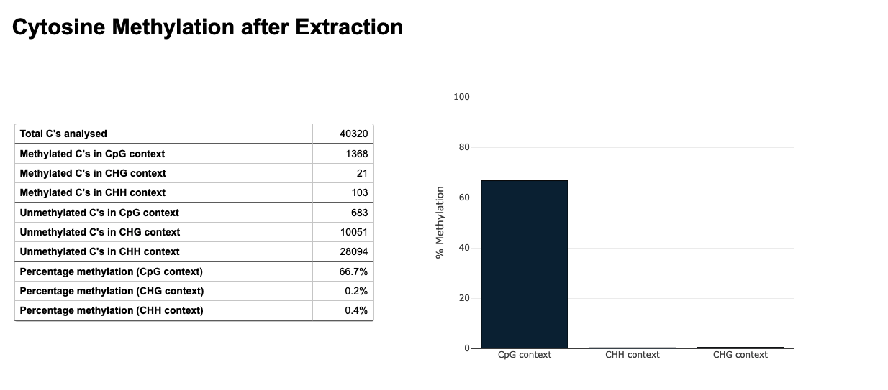


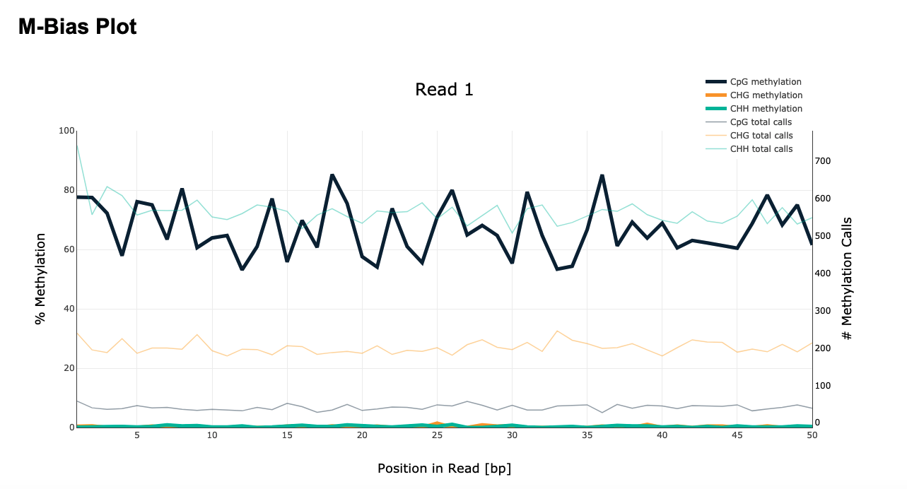


I observe that only 9.12% of sequences did not map uniquely. The cytosine methylation is majority in CpG context (which is the region where "nucleotides are followed by a guanine nucleotide in the linear sequence of bases along its 5' → 3' direction"). There were very few duplicates removed in the deduplication process.


**I.2 (1.5 pts) Methylation in cytosine at promoter regions normally suppresses the gene expression, while H3K4me3 and H3K27ac histone modifications at promoter regions imply higher gene expression. We have processed RRBS-seq data on the prostater cancer cell line dataset (https://www.encodeproject.org/experiments/ENCSR859PDD/) and report the high methylation signal sites in `data/Methylation.bed`. Draw violin plots of the expression level of genes with methylation, H3K4me3, and H3K27ac in their promoters. Could you find that the higher methylation signals repress the gene expression?**  

The `/n/stat115/2021/HW4/p1_data/ProstateCancer_H3K4me3_peaks.bed` and `/n/stat115/2021/HW4/p1_data/ProstateCancer_H3K27ac_peaks.bed` are the H3K4me3 and H3K27ac peaks files of prostate cancer. Try to find the intersection of loops and histone modification signal intervals. In the `/n/stat115/2021/HW4/p1_data/Expr_loc.txt`, the first three columns are chromosome coordinates, the fourth column is the gene expression score of a prostate cancer tissue, and the rest columns are the gene symbols.

**Hint1:** Use the preinstalled `bedtools` by calling `module load bedtools2`.

**Hint2:** Use `>` to write your results into an output file. Use `uniq` command to remove the duplicates from your intersections. e.g. `bedtools intersect {YOUR FLAGS} | uniq > OUTPUT.TXT`

**Hint3:** The methylation group might have a lower signal-noise ratio. So drop the genes with very low expression (< 0.0001) and use the log scale when you generate the violin plots for better visualization. You can use `ylim` and `scale_y_log10` from `ggplot`.

**Answer**: The total number of lines for Methylation is 1767 lines, H3K4me3 is 10740 lines, and H3K27ac is 9531 lines. Violin plots are provided below for expression level of genes with methylation, H3K4me3, and H3K27ac in their promoters using the fourth column (the gene expression score of a prostate cancer tissue). I found that the higher methylation signals do repress the gene expression because looking at the violin plot, the Methylation had fewer gene scores in the higher values and more at lower scores (hence it doesn't have a bulb shape at the top or widen at the top compared to the other groups).

```{bash eval=FALSE}
# YOUR BASH SCRIPTS HERE
# setup environment
module load bedtools2

# producing output files
bedtools intersect -a /n/stat115/2021/HW4/p1_data/Expr_loc.txt -b /n/stat115/2021/HW4/p1_data/ProstateCancer_H3K4me3_peaks.bed -wa | uniq > HW4/i2/H3K4me3.txt

bedtools intersect -a /n/stat115/2021/HW4/p1_data/Expr_loc.txt -b /n/stat115/2021/HW4/p1_data/ProstateCancer_H3K27ac_peaks.bed -wa | uniq > HW4/i2/H3K27ac.txt

bedtools intersect -a /n/stat115/2021/HW4/p1_data/Expr_loc.txt -b /n/stat115/2021/HW4/p1_data/Methylation.bed -wa | uniq > HW4/i2/Methylation.txt

# moving generated output to local drive
scp -r stat215u2107@login.rc.fas.harvard.edu:HW4/i2 "QI.2"
scp stat215u2107@login.rc.fas.harvard.edu:/n/stat115/2021/HW4/p1_data/Expr_loc.txt "QI.2/Background.txt"
```

```{r}
library(RColorBrewer)
library(ggplot2)

Background = read.delim("QI.2/Background.txt", header=F)
H3k4me3 = read.delim("QI.2/H3K4me3.txt", header=F)
H3k27ac = read.delim("QI.2/H3K27ac.txt", header=F)
Methylation = read.delim("QI.2/Methylation.txt", header=F)

nrow(H3k4me3); nrow(H3k27ac); nrow(Methylation)
```

```{r, warning=FALSE, message=FALSE}
expr_df = data.frame(expr = c(H3k4me3$V4, H3k27ac$V4, Methylation$V4, Background$V4), state = c(rep("H3k4me3", length(H3k4me3$V4)), rep("H3k27ac", length(H3k27ac$V4)), rep("Methylation", length(Methylation$V4)), rep("Background", length(Background$V4))))

getPalette <- colorRampPalette(brewer.pal(8, "Set2"))
ggplot(expr_df) +
    geom_violin(aes(x = state, y = expr, fill = state)) +
    theme_bw() +
    theme(
        axis.text.x = element_text(size = 10, face = "bold", hjust = 0.5, vjust = 0.5, angle = -45),
        axis.text.y = element_text(size = 10, face = "bold"),
        axis.title.x = element_text(size = 12, face = "bold"),
        axis.title.y = element_text(size = 12, face = "bold")
    ) + 
    scale_fill_manual(values = getPalette(length(unique(expr_df$state)))) +
    ylim(0.0001, 10) +
    scale_y_log10()
```


# Part II. HiC (5/6 pts)

Genome architecture plays a key role in nuclear functions. The spatial arrangement and proximity of genes have been linked to biological functions, such as gene replication, regulation, and transcription. The Hi-C technique allows researchers to extract the interaction frequency for all loci of a genome at high-throughput and at a genome-wide scale. In this part, we will learn how the HiC data integrates with other epigenetic data and genome architecture affects gene expression in prostate cancer.

**II.1 (2 pts) Given subsampled example fastq files generated by Hi-C technique(`/n/stat115/2021/HW4/p2_data/HiC_fq`), perform reads mapping, filtering, and binning to this data with runHiC(http://xiaotaowang.github.io/HiC_pipeline/quickstart.html). How about the quality of this subsampled data? Could you explain the QC criteria of Hi-C data?**

**Answer**: According to the documentation, the quality control criteria of Hi-C data is Unique-Mapping Ratio (low value of this metric indicates low sequencing quality, sample contamination or incomplete genome assembly), Self-Ligation Ratio, Dangling-Reads Ratio, and Long-Range Ratio (low value ($<0.15$) of this metric indicates the failed experiment). These statistics can help determine the quality of our Hi-C data. Fortunately, we can check the quality of this subsampled data using `runHiC quality`.

<u>**Instructions:**</u>

1. First load the prepared anaconda environment. Make sure use exactly the same version for python and the dependencies. Note the difference from doing the same on local machines, e.g. a laptop or PC.
```{bash eval=FALSE}
module load Anaconda3 python/3.7.7-fasrc01
conda activate /n/stat115/2021/HW4/conda_env37
module load samtools minimap2 bwa sratoolkit
```

**Answer**: Completed.

2. [Optional] The runHiC script takes the bwa index as the input. You can either use the one we used for HW3 `/n/stat115/2021/HW3/bwa_hg38_index` or build your own index separately.

**Answer**: Utilized the bwa and bash commands similar to how I did it in Q1 for HW3. For the sake of consistency, I will stick with the provided bwa index.

3. Note that the index file is **NOT*** the same as the one we used for bismark. What is the main difference between bowtie and bwa in practice? (Hint: https://www.biostars.org/p/134418/). Copy the index to your local dir and build the index.

**Answer**: The main difference between Bowtie and BWA in practice is speed and accuracy of the algorithm. BWA is a software package for mapping low-divergent sequences against a large reference genome, such as the human genome. Bowtie is an ultrafast, memory-efficient short read aligner; it aligns short DNA sequences (reads) to the human genome at a rate of over 25 million 35-bp reads per hour. Thus we see BWA and Bowtie are made for different scenarios. In addition, according to the forum discussion, BWA appears to be slower, albeit does a more sensitive search and is more accurate compared to Bowtie. However I also did some additional Google search and found this paper: https://www.ncbi.nlm.nih.gov/pmc/articles/PMC5834436/. The paper "conclude that there is not a single mapper that is ideal in all scenarios but rather the choice of alignment tool should be driven by the application and sequencing technology" in comparing BWA, Bowtie, and other algorithms. 

4. Prepare your working directory with the index files and your metadata file `datasets.tsv`. See http://xiaotaowang.github.io/HiC_pipeline/quickstart.html#create-the-meta-data-file. In our case we would use these following setup configuration. Make sure you have more than one replica sample in your metadata to avoid future ambiguity. If you skipped step 2, copy the prepared index file `/n/stat115/2021/HW4/p2_data/hg38` or `/n/home13/stat115u2102/hw4/setup/hg38_p2` to your wdr directly. Also download `hg38.chrom.sizes` from canvas to your wdr.

```
HiC_subreads GM06990 R1 HindIII
HiC_subreads GM06990 R2 HindIII
```

**Answer**: Bash commands below.

5. Check your wdr, which should have at least the following folders.
```
.
├── hg38
│   ├── hg38.fa
│   ├── hg38.fa.amb
│   ├── hg38.fa.ann
│   ├── hg38.fa.bwt
│   ├── hg38.fa.fai
│   ├── hg38.fa.pac
│   └── hg38.fa.sa
├── HiC_subreads
│   ├── HiC_subreads
│   ├── HiC_subreads_1.fastq
│   ├── HiC_subreads_2.fastq
│   └── HiC_subreads.completed
├── hg38.chrom.sizes
└── datasets.tsv
```

**Answer**: Attached is a screen shot of the directory (as per Bo Yuan's message on Slack, we shouldn't have HiC_subreads and HiC_subreads.complete prior to running runHiC).

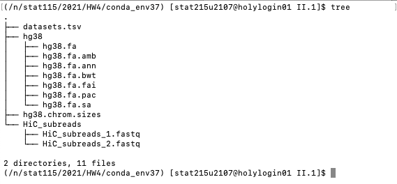

Run the runHiC commands and generate the stats table. Put here the output `*.stats` and plots `*.png` for the summary group `allReps` **ONLY**. What is the message you can read from the results.

**Answer**: The message I can read from the results is provided below. I show the output `*.stats` and plots `*.png` for the summary group `allReps`.

``` {bash eval=FALSE}
# YOUR BASH SCRIPTS HERE
# make the work directory
mkdir HW4/II.1
cd HW4/II.1
mkdir setup results
cd setup

# copy the prepared index file
cp -r /n/stat115/2021/HW4/p2_data/hg38 .

# making datasets.tsv
vim datasets.tsv

# copying the HiC_subreads
mkdir HiC_subreads
cp -r /n/stat115/2021/HW4/p2_data/HiC_fq/*.fastq HiC_subreads

# transferring the hg38.chrom.sizes (on local machine)
scp QII.1/hg38.chrom.sizes stat215u2107@login.rc.fas.harvard.edu:HW4/II.1/setup

# runHiC (step-by-step)
runHiC mapping -p setup -g hg38 -f HiC_subreads -F FASTQ -A bwa-mem -t 10 -O BAM --include-readid --include-sam --drop-seq --chunkSize 1500000 --logFile results/runHiC-mapping.log 

runHiC filtering --pairFolder pairs-hg38 --logFile results/runHiC-filtering.log --nproc 10

runHiC binning -f filtered-hg38/ --logFile results/runHiC-binning.log --nproc 10

# get report tables and figures
runHiC quality -m datasets.tsv -L filtered-hg38 --logFile results/runHiC.log

# copy results to local file
scp -r stat215u2107@login.rc.fas.harvard.edu:HW4/II.1/filtered-hg38 "QII.1"
```


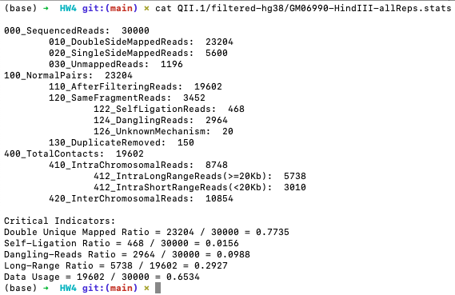

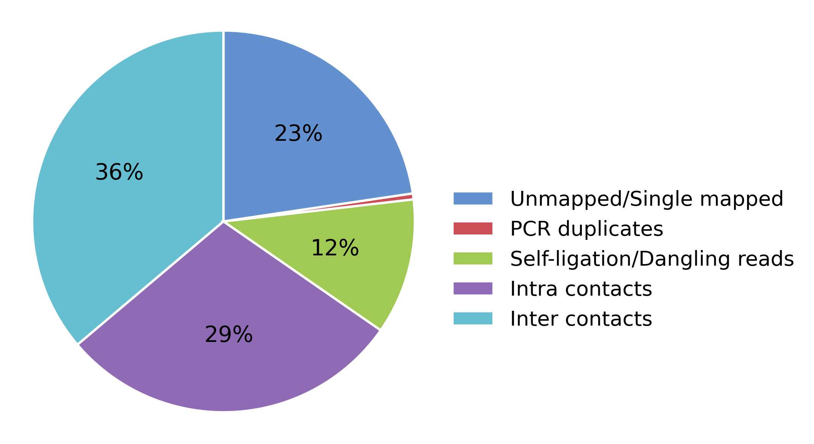

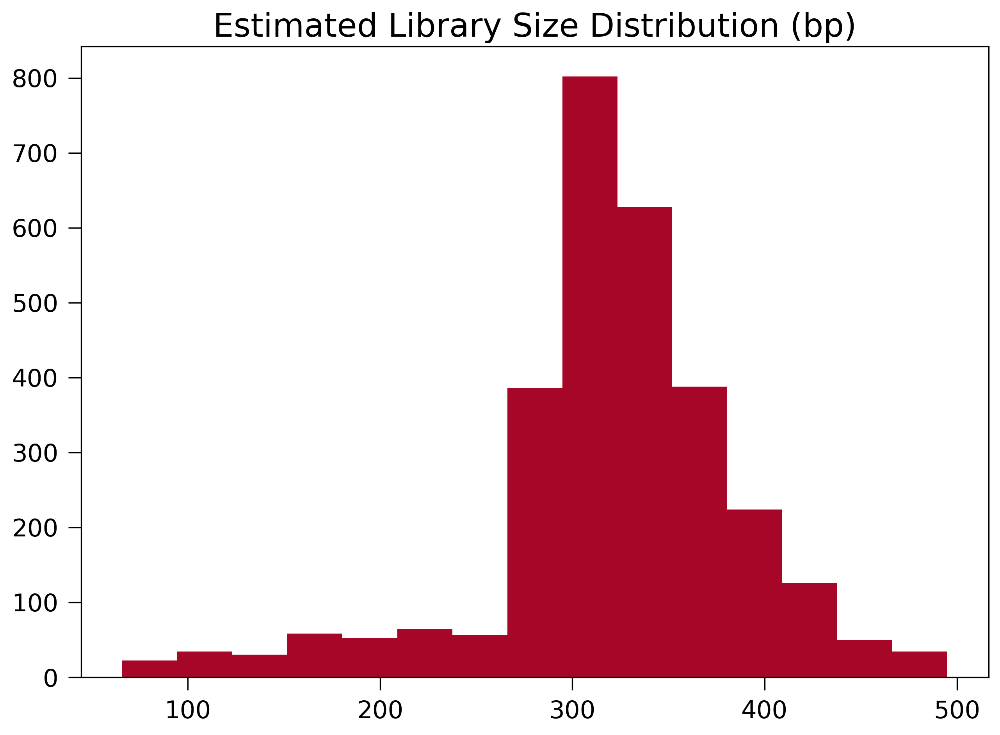

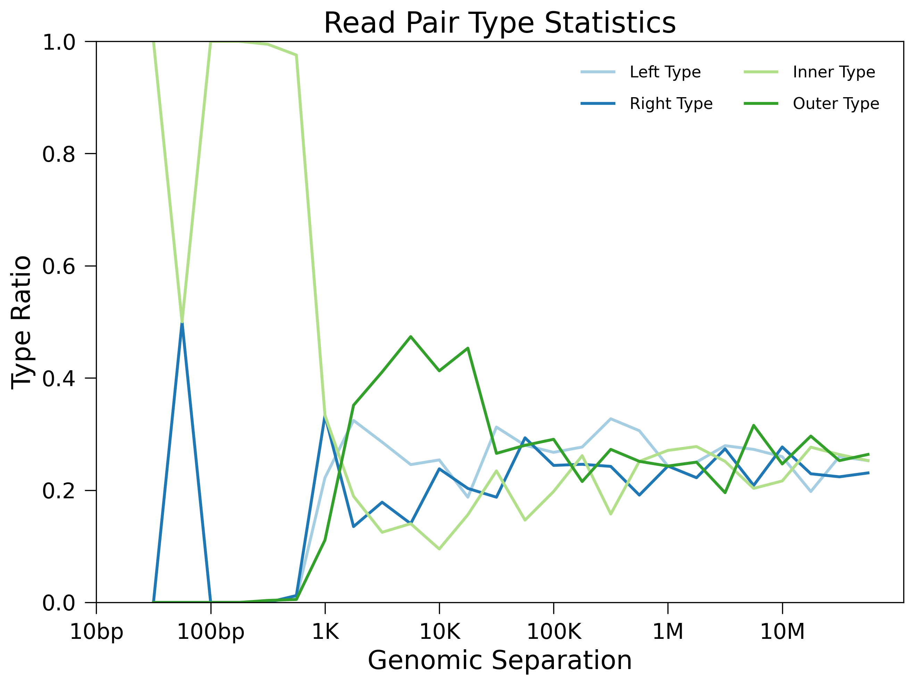

Observing this report, I see we have subpar quality. The Library-size distribution seems inconsistent and the lines on the Pair Type plot don't converge. According to the documentation (http://xiaotaowang.github.io/HiC_pipeline/quality.html), this could indicate we have QC issues with our data.


**II.2 (2 pts) In the II.1, you have learned how to generate a genomic interaction matrix on the example file. Here we provided a genomic interaction data on chr21 in prostate cancer(`data/chr21.chr21_10000.cool`). Normalize this data at 10k resolution and perform loop calling with 10% CTCF model. How many loops with >0.9 confidence can you find? Then draw a genomic contact heatmap to show the interaction in chr21. Are there any highly interactive regions?**

**Hint:** cooler(https://cooler.readthedocs.io/en/latest/) can perform normalization and peakachu(https://github.com/tariks/peakachu) can perform loop calling on Hi-C data. higlass(https://higlass.io/) may help with visualization.


**Answer**: Using cooler and peakachu, I get there are 78 loops with >0.9 confidence (count the number lines in the resulting bedpe file). Then I used higlass to draw genomic contact heatmap to show the interaction in chr21 (I attached a screenshot of my Jupyter Notebook as well). I also provide the heatmap that was generated by higlass. I found there are highly interactive regions between neighboring genomic regions lead to a strong diagonal pattern in the resulting heatmap.

```{bash eval=FALSE}
# YOUR BASH SCRIPTS HERE
# copy cool file
cp /n/stat115/2021/HW4/p2_data/chr21.chr21_10000.cool .

# cool normalize
cooler balance --max-iters 1000 chr21.chr21_10000.cool --force

hicConvertFormat -m chr21.chr21_10000.cool --inputFormat cool --outputFormat mcool -o chr21.chr21_10000.mcool

# transferring the mcool file to local drive
scp stat215u2107@login.rc.fas.harvard.edu:HW4/II.2/chr21.chr21_10000.mcool "QII.2"

# peakachu
cp /n/stat115/2021/HW4/p2_data/down10.ctcf.pkl .

peakachu score_genome -r 10000 -w 5 --balance -p chr21.chr21_10000.cool -m down10.ctcf.pkl -O ./peakachu_output

cd peakachu_output

peakachu pool -i chr21.bed -t 0.9 > chr21.loops.bedpe

# get number of lines in bedpe file
wc -l chr21.loops.bedpe     # 78
```

```{python eval=FALSE}
# YOUR HIGLASS CODES HERE
# Install higlass in Jupyter Notebook
import sys
!{sys.executable} -m pip install higlass-python

# Install on Terminal
jupyter nbextension install --py --sys-prefix --symlink higlass 
jupyter nbextension enable --py --sys-prefix higlass
jupyter notebook

# Inside my jupyter notebook
import higlass
from higlass.client import Track, View

# Define track set (dataset)
tsl = higlass.tilesets.cooler('chr21.chr21_10000.mcool')

# Define trackers (figure axes)
trl = Track('heatmap', tileset = tsl)

# Generate plots
view1 = View([trl])

# Display interactive output
display, server, viewconf = higlass.display([view1])
display
```

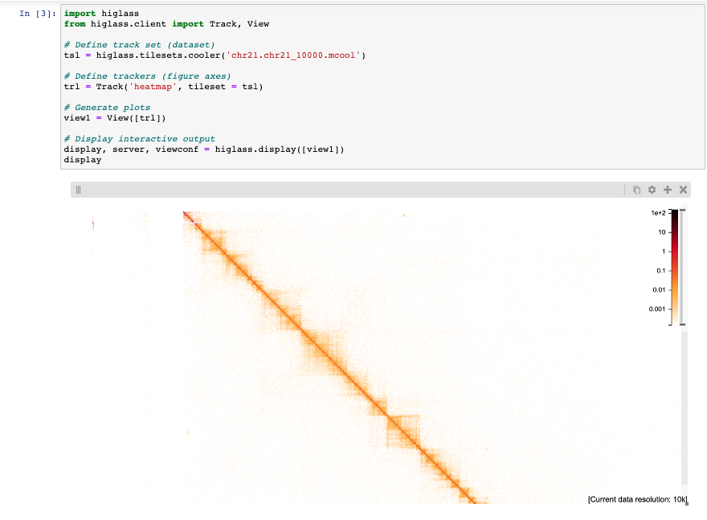


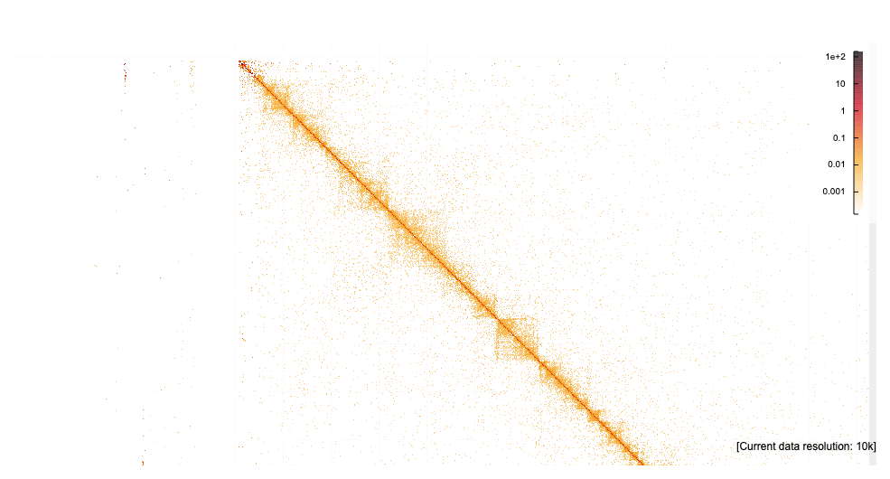


**II.3 (1 pt) Transcription factors help construct the chromatin loops. With the provided prostate cancer ATAC-seq peaks file(`data/tumor_ATAC_peaks.bed`), could you find the open regions in the loop anchors? What factors bind in the loop anchors? What potential roles may these factors play?**

**Answer**: I found the open regions in the loop anchors for the provided prostate cancer ATAC-seq peaks file(`data/tumor_ATAC_peaks.bed`) by using the bedpe file from II.2 and `bedtools intersect`. I found 62 regions because the resulting file had 62 lines. Then I used Homer to find motifs. According to Jiazhen on Slack, for findMotifsGenome.pl, "You can also use the HW3/bwa_hg38_index/hg38.fasta." In my `homerResults.html` file, I see 40 motif matches, however only the first 8 motifs don't get flagged as possible false positives. I provide a screen shot of these first motifs in the `homerResults.html` below which show the factors that bind in the loop anchors. I notice that motif #1 (FKH2) (a Forkhead family transcription factor) and motif #5 (ZmHOX2a) in my `homerResults.html` were motifs we saw in HW3 when we were exploring the tumor data (hence it seems consistent with our previous results). As we saw from HW3, these motifs are correlated with AR which is important for tumors.

```{bash eval=FALSE}
# YOUR BASH SCRIPTS HERE
# getting the anchors from bedpe data
awk 'BEGIN {OFS="\t"}{print $1,$2,$3}' ../II.2/peakachu_output/chr21.loops.bedpe > anchor1.txt
awk 'BEGIN {OFS="\t"}{print $4,$5,$6}' ../II.2/peakachu_output/chr21.loops.bedpe > anchor2.txt
cat anchor1.txt anchor2.txt > anchor.txt

# finding intersections
bedtools intersect -a /n/stat115/2021/HW4/p2_data/tumor_ATAC_peaks.bed -b anchor.txt > output.txt

# get number of lines in output file
wc -l output.txt     # 62

# switching to other conda environment
conda deactivate
source /n/stat115/2021/HW4/miniconda3/bin/activate
conda activate /n/stat115/2021/HW4/homer_env

# use homer to identify motifs
findMotifsGenome.pl output.txt /n/stat115/2021/HW3/bwa_hg38_index/hg38.fasta motifs

# moving homerResults.html to local directory
scp -r stat215u2107@login.rc.fas.harvard.edu:HW4/II.3/motifs "QII.3"
```


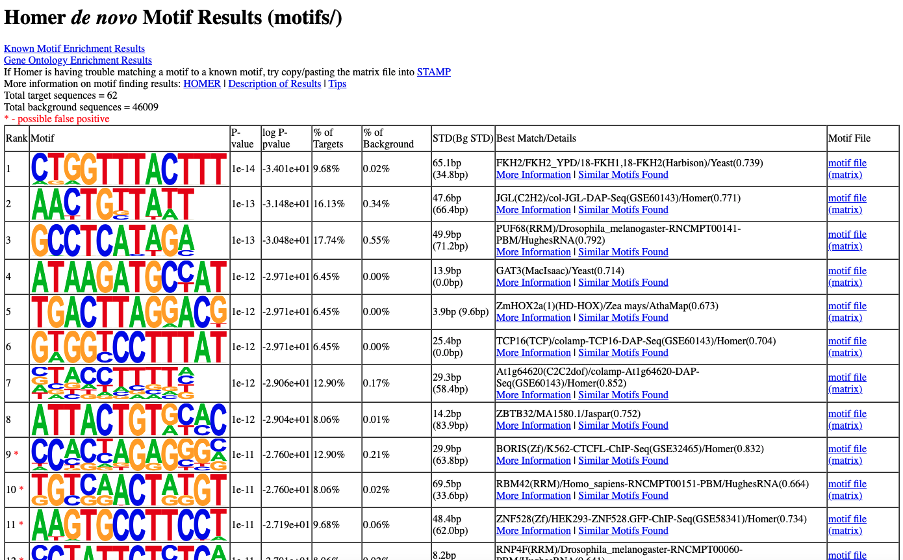


**II.4 (1 pt, graduates only) Normally histone modification H3K27ac marks the enhancer regions on the genome, and H3K4me3 marks the promoter regions. Use the prostate tumor H3K27ac and H3K4me3 peaks files in I.2 here. Based on the loop file, could you find the loops that contact an enhancer region with a gene promoter region on chr21? Do these target genes express higher than the genes without loops structure?**

**Answer**: I discussed with Jiazhen Rong privately about my approach and she confirmed my strategy. I intersect the anchor file from II.3 with the H3K4me3 bed file, H3K27ac bed file, and background (Expr_loc_chr21.txt) file. Then I find the common region and get my final output has 13 matches. I then make violin plots comparing the target genes with the genes without loops structure. I observe that the target genes are expressed higher than the genes without loops structure (the violin plot shows the target genes are predominant at higher values in terms of gene expression metric).

```{bash eval=FALSE}
# YOUR BASH SCRIPTS HERE
# setting up QII.4 folder
cp ../II.3/anchor.txt .

# finding intersections with anchors
bedtools intersect -a /n/stat115/2021/HW4/p1_data/ProstateCancer_H3K4me3_peaks.bed -b anchor.txt > H3K4me3_output.txt

bedtools intersect -a /n/stat115/2021/HW4/p1_data/ProstateCancer_H3K27ac_peaks.bed -b anchor.txt > H3K27ac_output.txt

bedtools intersect -a /n/stat115/2021/HW4/p2_data/Expr_loc_chr21.txt -b anchor.txt > expr_loc_chr21_output.txt

# finding intersection between enhancer and promoter files
bedtools intersect -a H3K27ac_output.txt -b H3K4me3_output.txt > promoter_enhancer.txt

# finding intersection between all three
bedtools intersect -a expr_loc_chr21_output.txt -b promoter_enhancer.txt > final_output.txt

# getting number of loops 
wc -l final_output.txt      # 13 lines

# copy to local directory
scp stat215u2107@login.rc.fas.harvard.edu:HW4/II.4/expr_loc_chr21_output.txt "QII.4"
scp stat215u2107@login.rc.fas.harvard.edu:HW4/II.4/final_output.txt "QII.4"
```

```{r, warning=FALSE, message=FALSE}
# YOUR R SCRIPTS HERE
with_loop = read.delim("QII.4/final_output.txt", header=F)
without_loop = read.delim("QII.4/expr_loc_chr21_output.txt", header=F)

expr_df = data.frame(expr = c(with_loop$V4, without_loop$V4), state = c(rep("Target Gene", length(with_loop$V4)), rep("General Gene", length(without_loop$V4))))

getPalette <- colorRampPalette(brewer.pal(8, "Set2"))
ggplot(expr_df) +
    geom_violin(aes(x = state, y = expr, fill = state)) +
    theme_bw() +
    theme(
        axis.text.x = element_text(size = 10, face = "bold", hjust = 0.5, vjust = 0.5, angle = -45),
        axis.text.y = element_text(size = 10, face = "bold"),
        axis.title.x = element_text(size = 12, face = "bold"),
        axis.title.y = element_text(size = 12, face = "bold")
    ) + 
    scale_fill_manual(values = getPalette(length(unique(expr_df$state)))) +
    ylim(0.0001, 10) +
    scale_y_log10()
```


# Part III. Hidden Markov Model and TAD boundaries (2 pts)

Topologically associating domains (TADs) define genomic intervals, where sequences within a TAD physically interact more frequently with each other than with sequences outside the TAD. TADs are often defined by HiC (https://www.ncbi.nlm.nih.gov/pmc/articles/PMC3149993/), an experimental technique designed to study the three-dimensional architecture of genomes. HiC generates PE sequenced data, where the two mate pairs indicate two genomic regions that are might be far apart in the genome, but physically interact with each other. If we look across the genome in bins (40kb in the early paper, but now can go down to 5-10kb with deeper sequencing), we could find reads that are mapped there and check whether their interacting mate pairs are mapped upstream or downstream. In each bin, we can calculate a directional index (DI) to quantify the degree of upstream or downstream bias of a given bin (for more details, see the supplement- `Supplement_10.1038_nature11082.pdf` ). For this HW, we ask you to implement a hidden Markov Model (Viterbi) to find regions with upstream bias (DI < 0) and those with downstream bias (DI > 0), even though the DI in individual bins might have some noise. This way, TAD boundaries could be discovered as clusters of bins from negative DIs to positive DIs (see Supplementary Figure 12b).

For simplicity, we will only have two hidden states (upstream, downstream), and use the following HMM parameters (these do not necessarily capture the real data distribution, but just to help your implementation):

```
Initial probability: upstream = 0.5, downstream = 0.5
Transition probability: Pb(up to up) = Pb(dn to dn) = 0.9, Pb(up to dn) = Pb(dn to up) = 0.1

Emission probabilities:
P{<-1200, [-1200,-800), [-800,-500), [-500,0), [0,500), [-500,800), [800, 1200), >= 1200 | upstream} = (0.01, 0.01, 0.02, 0.04, 0.65, 0.15, 0.08, 0.04)
P{<-1200, [-1200,-800), [-800,-500), [-500,0), [0,500), [-500,800), [800, 1200), >= 1200 | downstream} = (0.04, 0.08, 0.15, 0.65, 0.04, 0.02, 0.01, 0.01)

```

**Given the DI file (`data/ESC.Dixon_2015.DI.chr21.txt`), implement and utilize the Viterbi algorithm to predict the hidden states of the Hi-C data. Visualize your result with a graph utilizing the following: midpoint of genomic bin on the x-axis; DI score per bin on the y-axis; color: hidden state of the HMM.**  

**Hint1**: Examples HMM code can be found at:
http://www.adeveloperdiary.com/data-science/machine-learning/implement-viterbi-algorithm-in-hidden-markov-model-using-python-and-r/

**Hint2**: The observations are continuous or have too many discrete values. Try binning them into a few discrete regions. Use `cut` function built in R.

**Answer**: I first `scp` the file to my local directory. Then I utilized the HMM example code in guiding my answer. My results align with the results from the lab. Plots of the initial data and finalized hidden markov model are provided.

```{bash eval=FALSE}
# YOUR BASH SCRIPTS HERE
# copying the data file
scp stat215u2107@login.rc.fas.harvard.edu:/n/stat115/2021/HW4/p3_data/ESC.Dixon_2015.DI.chr21.txt "p3/DI_data.txt"
```

```{r}
# YOUR SCRIPTS HERE
# load the data
data = read.delim("p3/DI_data.txt", header = F, col.names = c("chr", "start", "end", "DI"))
data$mid = (data$end + data$start) / 2

# making plots
plot_df = as.data.frame(cbind(mid_point = data$mid, DI = data$DI))
ggplot(plot_df, aes(x = as.numeric(as.character(mid_point)),
                    y = as.numeric(as.character(DI)))) +
    geom_point() +
    labs(y = "Midpoints", x = "DI Score") +
    ggtitle("Hidden Markov Model Data - Initial Graph") +
    theme(axis.text.x = element_text(angle = 90, hjust = 0.5)) +
    geom_col(width = 0.5)
```
```{r}
# make discrete states from continuous indices
obs_states = cut(data$DI, breaks = c(min(data$DI) - 1,
                                     -1200, -800, -500, 0,
                                     500, 800, 1200, max(data$DI) + 1),
                 right = FALSE)

# Viterbi algorithm
Viterbi = function(v, a, b, initial_distribution) {
    T = length(v)   # number of time points
    M = nrow(a)     # number of hidden states
    prev = matrix(0, T-1, M)    # matrix storing from which previous hidden state
    omega = matrix(0, M, T)     # matrix storing probability of each hidden state
        
    omega[, 1] = log(initial_distribution * b[, v[1]])  # log scale - prevent underflow
    
    # iterate through time points
    for (t in 2:T) {
        # iterate through hidden state
        for (s in 1:M) {
            probs = omega[, t-1] + log(a[, s]) + log(b[s, v[t]])
            prev[t-1, s] = which.max(probs)
            omega[s, t] = max(probs)
        }
    }
    
    S = rep(0, T)
    last_state = which.max(omega[, ncol(omega)])
    S[1] = last_state
    
    j = 2
    for (i in (T-1):1){
        S[j] = prev[i, last_state]
        last_state = prev[i, last_state]
        j = j + 1
    } 
    
    S[which(S==1)] = 'up'       # upstream
    S[which(S==2)] = 'down'     # downstream
    
    S = rev(S)
    
    return(S)
}

# initialize our hidden markov model
M = 2   # hidden states (upstream vs downstream)
K = 8   # output type - 8 possible outputs
A = matrix(c(0.9, 0.1, 0.1, 0.9), M, M)     # transition probabilities
B = matrix(c(0.01, 0.01, 0.02, 0.04, 0.65, 0.15, 0.08, 0.04,
             0.04, 0.08, 0.15, 0.65, 0.04, 0.02, 0.01, 0.01),
           M, K, byrow = TRUE)              # emission probabilities
initial_distribution = c(0.5, 0.5)

# make our hidden markov model
hmm = Viterbi(as.numeric(obs_states), A, B, initial_distribution)

# plot the result
plot_df = as.data.frame(cbind(mid_point = data$mid, DI = data$DI, state = hmm))
ggplot(plot_df, aes(x = as.numeric(as.character(mid_point)),
                    y = as.numeric(as.character(DI)),
                    color = as.factor(state))) +
    geom_point() +
    labs(y = "Midpoints", x = "DI Score") +
    ggtitle("Hidden Markov Model Completed Graph") +
    theme(axis.text.x = element_text(angle = 90, hjust = 0.5)) +
    geom_col(width = 0.5)
```


# Part IV: GWAS Followup (3 pts)

The NHGRI-EBI GWAS Catalog is a curated dataset of trait-associated genetic variants for human. While it provides association between single-nucleotide polymorphisms (SNPs) and trait (i.e. cancer), the genetic variants in GWAS catalog are not necessarily causative or functional for a trait, since SNPs can be highly correlated measured by linkage disequilibrium (LD). To learn the potential functional effect of a certain SNP, especially the non-coding variants, we can use RegulomeDB to explore the potential function of the SNP.

You will explore the following online resources: The NHGRI-EBI GWAS catalog (https://www.ebi.ac.uk/gwas/), dbSNP (https://www.ncbi.nlm.nih.gov/snp/ ), LDLink (https://ldlink.nci.nih.gov/), and RegulomeDB (the beta version http://regulomedb.org or the more stable older version http://legacy.regulomedb.org/).

**IV.1 Explore whether there are genetic variants within the gene BRCA2 which are associated with any traits. What traits are associated with the BRCA2 variants? Which SNP has the smallest p-value related to breast cancer? What is the risk allele?**  

**Answer**:


**IV.2 For the BRCA2 SNP with the most significant association with breast cancer, what consequence does the risk allele have on the BRCA2 protein sequence? Based on 1000 Genomes in LDLink, what is the allele frequency of the risk allele among the 5 ethnicities In the population with the highest risk in the resource, what is the expected number of people with heterozygous genotype at this SNP, assuming linkage disequilibrium?** 


**Answer**:


**IV.3 Explore a certain SNP, rs4784227, that was reported to be associated with breast cancer. Is it an intergenic, exonic or intronic variant? What gene does it fall in?**  

**Answer**:


**IV.4 Explore the SNP rs4784227 in RegulomeDB. What functional category does the rank score (or Regulome DB Score) implicate? What factors does RegulomeDB take into consideration while scoring the potential function of SNPs?**

**Answer**:


**IV.5 Describe the evidence that implicates the regulatory potential of rs4784227, for example, list several transcription factors with binding peaks overlapping this SNP; report the cell types with open chromatin regions overlapping this SNP.**

**Answer**:


**IV.6 [Graduate Students] Read the paper by Cowper-Sal et al. (PMID 23001124) and summarize the potential mechanisms of the above SNP’s function in terms of affecting transcription factor-DNA interaction and regulating genes.**

**Answer**:


