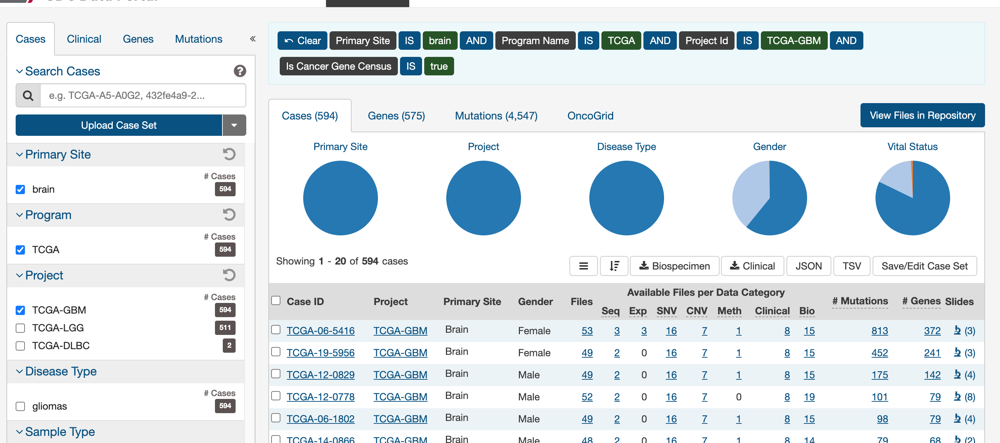
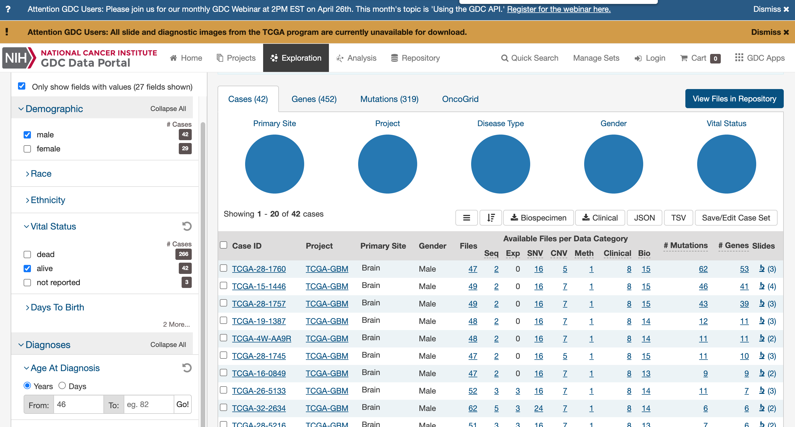

```{r,warning=F,message=F,include=F}
library(ggplot2)
library(cowplot)
library(limma)
library(survival)
library(survminer)
library(corrplot)
library(MAGeCKFlute)
library(pheatmap)
library(FirebrowseR)
library(glmnet)
library(dplyr)
library(plyr)
library(factoextra)
library(matrixStats)
library(LaplacesDemon)
library(stringr)
```

Data for this HW is stored at /n/stat115/2021/HW6/data

## Part I: Data exploration on TCGA

The Cancer Genome Atlas (TCGA) is an NCI project to comprehensively 
profile over 10K tumors in 33 cancer types. In this homework, we are 
going to explore TCGA data analysis. 

Q1. Go to TCGA GDC website (https://portal.gdc.cancer.gov/) and explore 
the GDC data portal. How many glioblastoma (GBM) cases in TCGA meet ALL 
of the following requirements?

1. Male; 

2. Diagnosed at the age above 45; 

3. Still alive.


**Answer**: One the TCGA GDC website, I found 42 cases met all the requirements. Below are the screenshots of the filters I applied.






Q2. TCGA GDC (https://portal.gdc.cancer.gov/) and Broad Firehose (http://firebrowse.org/) both provide processed TCGA data for downloading and downstream analysis. Download clinical data of GBM. What’s the average diagnosed age of all GBM patients?

**Answer**: The abbreviation for glioblastoma is GBM. The average diagnosed age of all GBM patients is 57.81681 years.

```{r}
# get abbreviations
cohorts = Metadata.Cohorts(format = "csv")
head(cohorts, 15)
```
```{r}
# Download GBM data (have to do this because we can only receive 150 patients at a time)
all.Received <- FALSE
page.Counter <- 1
page.size <- 150
gbm_pats <- list()
while(all.Received == FALSE) {
    gbm_pats[[page.Counter]] <- Samples.Clinical(format = "csv",
            cohort = "GBM", page_size = page.size, page = page.Counter)
    if(page.Counter > 1) {
        colnames(gbm_pats[[page.Counter]]) <-
            colnames(gbm_pats[[page.Counter-1]])
    }

    if(nrow(gbm_pats[[page.Counter]]) < page.size) {
        all.Received = TRUE
    } else {
        page.Counter = page.Counter + 1
    }
}

gbm_pats <- do.call(rbind, gbm_pats)

#Dimension of the table containing patient info
dim(gbm_pats)
```
```{r}
# get average age of diagnosis
mean(gbm_pats$age_at_initial_pathologic_diagnosis)
```


## Part II – Tumor Subtypes

Q1. GBM is one of the earliest cancer types to be processed by TCGA, and the expression profiling was initially done with Affymetrix microarray. Also, with brain cancer, it is hard to get sufficient number of normal samples. 
We provide the pre-processed expression matrix in (GBM_expr.txt) where samples are columns and genes are rows. Do a K-means (k=3) clustering from all the genes and the most variable 2000 genes. Do tumor and normal samples separate in different clusters? Do the tumors samples consistently separate into 2 clusters, regardless of whether you use all the genes or most variable genes? 

**Answer**: I couldn't find the GBM_expr.txt file on cannon so I instead pulled the file from the course's github from the 2020 HW repo. I posted a question on Slack about this however I received no response, so I'll do the analysis with this data. Note the code would be the same if we provided another file.

The file provides 60 tumor samples and 10 normal samples. The data is already log2-transformed. Samples that start with `Normal` are normal samples while those that start with `TCGA` will be the tumor samples. I'll do K-means (`k = 3`) with all genes and top 2000 variable genes with the recommended parameters of `nstart = 10` and `iter.max = 100`

```{bash, eval=FALSE}
# get the file (missing from cannon)
scp stat215u2107@login.rc.fas.harvard.edu:/n/stat115/2021/HW6/data/GBM_expr.txt part2/GBM_expr.txt
```

```{r}
# your code here
gbm_expr = read.csv("part2/GBM_expr.txt", sep = "\t")
```

```{r}
# K-means for all genes
set.seed(215)
gbm_expr_all = t(gbm_expr[, -1])
k3 = kmeans(gbm_expr_all, centers = 3, nstart = 10, iter.max = 100)
fviz_cluster(k3, data = gbm_expr_all, geom = "point")
table(k3$cluster)
```

The above K-means separates the normal and tumor samples based on **all genes**. The normal samples are the green cluster (cluster 2) with 10 samples. We also see two separate clusters (red cluster 1 and blue cluster 3) for the tumor samples each with 30 samples (however there is some small overlap). I check what samples got placed in which clusters by exploring the `k3` object.

```{r}
# find the top 2000 variable genes
gbm_expr_top2k = gbm_expr[, -1] # make copy with numbers
gbm_expr_top2k$var = rowVars(data.matrix(gbm_expr_top2k)) # find variances
gbm_expr_top2k = gbm_expr_top2k[order(-gbm_expr_top2k$var), ] # sort genes
gbm_expr_top2k = head(gbm_expr_top2k, 2000) # get top 2000 variable genes
gbm_expr_top2k = gbm_expr_top2k[, !names(gbm_expr_top2k) %in% c("var")] # drop the variance column
```

```{r}
# K-means for top 2000 variable genes
set.seed(215)
gbm_expr_top2k_kmeans = t(gbm_expr_top2k)
k3 = kmeans(gbm_expr_top2k_kmeans, centers = 3, nstart = 10, iter.max = 100)
fviz_cluster(k3, data = gbm_expr_top2k_kmeans, geom = "point")
table(k3$cluster)
```

The above K-means separates the normal and tumor samples based on **top 2000 variable genes**. The normal samples are the green cluster (cluster 2) with 10 samples. We also see two separate clusters (red cluster 1 and blue cluster 3) for the tumor samples each with 30 samples. 

Therefore, using top 2000 variable genes and all genes results in nice cluster separation - there's clear division among the normal, and two types of tumor samples. However the K-means graph with top 2000 variable genes looks better than the K-means graph with all genes as there are no overlaps in the clusters and the PCs explain more of the variance. Hence, we'll stick with using top 2000 variable gene for future analysis.


Q2. LIMMA is a BioConductor package that does differential expression between microarrays, RNA-seq, and can remove batch effects (especially if you have experimental design with complex batches). Use LIMMA to see how many genes are differentially expressed between the two GBM subtypes (with FDR < 0.05 and logFC > 1.5)? 

**Answer**: We are interested in the two GBM subtypes - I'll use the two clusters corresponding to the tumor samples only from Q1 using only the 2000 top variable genes - those are namely clusters 1 and 3. We will need make a design matrix. After that, we did LIMMA analysis. Using `ebayes` and `topTable` (which is specified with the criteria FDR < 0.05 and logFC > 1.5 - we can view adjusted p-value as equivalent to FDR in topTable), I got 385 genes are differentially expressed between the two GBM subtypes.

```{r}
# remaking the top 2K variable genes with proper row names
gbm_expr_top2k = gbm_expr 
rownames(gbm_expr_top2k) = gbm_expr$X # set rownames as genes
gbm_expr_top2k = gbm_expr_top2k[, -1] # drop gene name row
gbm_expr_top2k$var = rowVars(data.matrix(gbm_expr_top2k)) # find variances
gbm_expr_top2k = gbm_expr_top2k[order(-gbm_expr_top2k$var), ] # sort genes
gbm_expr_top2k = head(gbm_expr_top2k, 2000) # get top 2000 variable genes
gbm_expr_top2k = gbm_expr_top2k[, !names(gbm_expr_top2k) %in% c("var")] # drop the variance column
```

```{r}
# make the design matrix
tumor_clusters = data.frame(k3$cluster[c(1:60)]) # get the tumor clusters
tumor_clusters$type = 1*(tumor_clusters$k3.cluster.c.1.60.. == 1) # label the types
design_matrix = model.matrix(~ type, tumor_clusters) # get design matrix

# LIMMA analysis
lmfit_expr = lmFit(gbm_expr_top2k[, c(1:60)], design_matrix)
lmfit_expr = eBayes(lmfit_expr)
dep_expr = topTable(lmfit_expr, coef = 2, p.value = 0.05, lfc = 1.5, number = 2000)
head(dep_expr, 10)
nrow(dep_expr)
```


Q3. For Graduate Students: From the DNA methylation profiles (GBM_meth.txt), how many genes are significantly differentially methylated between the two subtypes? Are DNA methylation associated with higher or lower expression of these genes? How many differentially expressed genes have an epigenetic (DNA methylation) cause? 

**Answer**: First we get the DNA methylation profiles from Cannon. Not all samples have methylation profiles, so we need to redesign the design matrix by focusing on the samples we have in DNA methylation profiles. A quick inspection shows us that the samples in DNA methylation profiles are all tumor samples that correspond by the sample label from the previous questions. I perform this matching. We also need to logit transform the values since the methylation values is in range 0 to 1 before running limma. I'll also filter the DNA methylation profiles to the top 2000 variable genes similar to how we focused on top 2000 variable genes in the expression data.

Using `ebayes` and `topTable` (which is specified with the criteria FDR < 0.05 and logFC > 1.5), I got 735 genes are differentially methylated between the two GBM subtypes. 

To compare with methylation with expression, I will use `intersect()`, then plot methylation logFC against expression logFC, and calculate the association. I got that 62 genes are differentially methylated and differentially expressed. The resulting plot below shows a negative association between the two, and the resulting correlation is -0.4954892. This indicates that high methylation is associated with low gene expression which aligns with our in class discussion on methylation and gene expression.

To determine the number of differentially expressed genes that have an epigenetic (DNA methylation) cause, I'll look at the genes I get from `intersect()` and find those that have opposite differential expression and methylation directions (according to lab 10.2). I found 60 such genes.

```{bash, eval=FALSE}
# get the file 
scp stat215u2107@login.rc.fas.harvard.edu:/n/stat115/2021/HW6/data/GBM_meth.txt part2/GBM_meth.txt
```

```{r}
# load in the data
gbm_meth = read.csv("part2/GBM_meth.txt", sep = "\t")
rownames(gbm_meth) = gbm_meth$X # set rownames as genes
gbm_meth = gbm_meth[, -1] # drop gene name row

# filter for top 2000 variable genes
gbm_meth$var = rowVars(data.matrix(gbm_meth)) # find variances
gbm_meth = gbm_meth[order(-gbm_meth$var), ] # sort genes
gbm_meth_top2k = head(gbm_meth, 2000) # get top 2000 variable genes
gbm_meth_top2k = gbm_meth_top2k[, !names(gbm_meth_top2k) %in% c("var")] # drop the variance column

gbm_meth_top2k = log(gbm_meth_top2k/(1 - gbm_meth_top2k)) # performing logit
```

```{r}
# subset the design_matrix
meth_design_matrix = subset(design_matrix, rownames(design_matrix) %in% colnames(gbm_meth_top2k))

# LIMMA analysis
lmfit_meth = lmFit(gbm_meth_top2k, meth_design_matrix)
lmfit_meth = eBayes(lmfit_meth)
dep_meth = topTable(lmfit_meth, coef = 2, p.value = 0.05, lfc = 1.5, number = 2000)
head(dep_meth, 10)
nrow(dep_meth)
```

```{r}
# compare with methylation with expression
gene_intersect = intersect(rownames(dep_expr), rownames(dep_meth)) # find common genes
length(gene_intersect) # find number of common genes

# construct a dataframe of common genes methylation logFC and expression logFC
common_gene = data.frame(row.names = gene_intersect,
                         exprLFC = dep_expr[gene_intersect, ]$logFC,
                         methLFC = dep_meth[gene_intersect, ]$logFC)

# make plots of methylation logFC vs expression logFC
plot(common_gene$exprLFC, common_gene$methLFC,
     main = "Methylation logFC vs Expression logFC",
     xlab = "Expression LFC",
     ylab = "Methylation LFC")

# association
cor(common_gene$exprLFC, common_gene$methLFC)
```

```{r}
# determine the number of differentially expressed genes that have an epigenetic (DNA methylation) cause
same_direction = function(a,b) {
  ifelse(a == 0 | b == 0, as.logical("FALSE"), !xor(sign(a)+1,sign(b)+1)) 
}

sum(!same_direction(common_gene$exprLFC, common_gene$methLFC))
```


Q4. With the survival data of the GBM tumors (GBM_clin.txt), make a Kaplan-Meier Curve to compare the two subtypes of GBM patients. Is there a significant difference in patient outcome between the two subtypes? 

**Answer**: First I get the file from Cannon. Then I format the data (since the names are slightly different - uses dashes instead of periods). Finally I make the Kaplan-Meier Curve to compare the two subtypes of GBM patients. I notice that there a significant difference in patient outcome between the two subtypes because the gap between the two curve (type 0 has higher survival). The logrank test provides a p-value of 9e-04 which indicates the survival curves are significantly different across the two levels of covariates.

```{bash, eval=FALSE}
# get the file 
scp stat215u2107@login.rc.fas.harvard.edu:/n/stat115/2021/HW6/data/GBM_clin.txt part2/GBM_clin.txt
```

```{r}
# load data
gbm_clin = read.csv("part2/GBM_clin.txt", sep = "\t")

# format the data
gbm_clin$X = str_replace_all(gbm_clin$X, "-", ".")
rownames(gbm_clin) = gbm_clin$X

# add in subtype information
kmc_data = merge(gbm_clin, tumor_clusters, by = 0)
```

```{r}
# Make the Kaplan-Meier Curve
kmc_fit = survfit(Surv(days.to.death, vital.status) ~ type, data = kmc_data)
ggsurvplot(kmc_fit, pval = TRUE, pval.method = TRUE) +
    ggtitle("Survival for GBM Subtypes")
```


Q5. For Graduate Students: Use the differential genes (say this is Y number of genes) between the two GBM subtypes as a gene signature to do a Cox regression of the tumor samples. Does it give significant predictive power of patient outcome?

**Answer**: The cox regression models the hazard ratio against a set of covariates (in this case the differential genes). We will use the differentially expressed genes (as instructed from slack) as the predictors. This requires formatting our data table accordingly. Additionally, we need to perform lasso regression to identify the genes we should include since we have 385 differentially expressed genes compared to 60 samples. We perform the analysis provided in lab. I found the follow genes had non-zero coefficients in the LASSO procedure: PPCS, C1S, and TNC.

Thus I'll perform Cox regression on the survival object against cluster type, PPCS, C1S, and TNC (results below). From the summary output, I see none of the predictors are statistically significant at $p < 0.05$. This is different from our results in Q4 where the type was statistically significant. However, both this model and the Kaplan-Meier Curve agree on the direction of effect for cluster type. We saw in the curve above, cluster 1 had lower survivor probability and in this cox model, we see a negative coefficient for type which agrees with the curve. 

The cox model demonstrates significant predictive power of patient outcome, as the Likelihood ratio test, Wald test, and Score (logrank) test all attain significant p-values.

```{r}
# make the dataframe
cox_data = data.frame(row.names = kmc_data$X,
                      "time" = kmc_data$days.to.death,
                      "death" = kmc_data$vital.status,
                      "type" = kmc_data$type)

# get the gene signatures
covariates = data.frame(t(gbm_expr_top2k[rownames(dep_expr), c(1:60)]))

# format data frame
cox_data = merge(cox_data, covariates, by = 0)
cox_data_nona = na.omit(cox_data)
```


```{r}
# lasso analysis
x = as.matrix(cox_data_nona[,-c(1:4)]) 
survobj = Surv(cox_data_nona$time, cox_data_nona$death)
cvfit = cv.glmnet(x, survobj, family = "cox", alpha = 1) 
cvfit
```


```{r}
# get non-zero coefficients
rownames(coef(cvfit, s = 'lambda.min'))[coef(cvfit, s = 'lambda.min')[,1]!= 0]
```

```{r}
# cox regression
coxreg = coxph(Surv(time, death) ~ type + PPCS + C1S + TNC, data = cox_data)
summary(coxreg)
```


Q6. For Graduate Students: Many studies use gene signatures to predict prognosis of patients. Take a look at this paper: http://journals.plos.org/ploscompbiol/article?id=10.1371/journal.pcbi.1002240. It turns out that most published gene signatures are not significantly more associated with outcome than random predictors. Write a script to randomly sample Y genes in this expression data as a gene signature and do Cox regression on the sampled signature to predict patient outcome. Automate the script and random sample followed by Cox regression 100 times. How does your signature in Q5 compared to random signatures in predicting outcome? 

**Answer**: The script to randomly sample genes in this expression data as a gene signature and do Cox regression on the sampled signature to predict patient outcome is provided below. In Q4, we found from our LASSO analysis that 3 genes had non-zero coefficients. This will be the number of genes we randomly sample. Moreover, we'll sample from the entire set of genes as opposed to restricting ourselves to the top 2000 variable genes. The criterion to evaluate model performance will be AIC. Lower AIC indicate a better model!

```{r}
# baseline AIC performance
extractAIC(coxreg)
```

```{r}
set.seed(215) # get consistent results
k = 3 # number of genes to sample from Q4
iter = 100 # number of iterations

# data process of samples and genes 
gbm_expr_samples = gbm_expr
rownames(gbm_expr_samples) = gbm_expr_samples$X
gbm_expr_samples = data.frame(t(gbm_expr_samples[, -1]))[c(1:60), ]

# keep track of our results
sims = matrix(, nrow = iter, ncol = k + 1)

for (i in 1:iter) {
  # make our dataframe
  cox_data_iter = data.frame(row.names = kmc_data$X,
                      "time" = kmc_data$days.to.death,
                      "death" = kmc_data$vital.status,
                      "type" = kmc_data$type)
  
  # get random gene
  genes_iter = sample(colnames(gbm_expr_samples), 3)
  
  # update cox data 
  cox_data_iter = merge(cox_data_iter, 
                        gbm_expr_samples[,genes_iter],
                        by = 0)[, -1]
  
  # compute model
  coxreg_iter = coxph(Surv(time, death) ~ ., data = cox_data_iter)
  
  # store results
  sims[i, 1:k] = genes_iter
  sims[i, k+1] = extractAIC(coxreg_iter)[2]
}
```


```{r}
# Visualization and Analysis of the results
sims = data.frame(sims)
colnames(sims) = c("Gene1", "Gene2", "Gene3", "AIC")
sims$AIC = as.numeric(sims$AIC)

# histogram
hist(sims$AIC, xlab = "AIC",
     main = "Cox Models with Random Genes")
abline(v = extractAIC(coxreg)[2], col = "red", lwd = 3, lty = 2)

# print genes with best AICs from the random process
head(sims[order(sims$AIC),], 5)
```

The baseline AIC from the cox model in Q4 was 227.5671. I performed the process 100 times, storing the genes that were used and the AIC. I made a histogram of from the resulting AICs - the red line is our base AIC from Q4. We see the cox model with differentially expressed genes chosen by LASSO performed much better using the AIC as criteria. Looking at the best cox models from the simulations, our original cox model from Q4 beat. The best cox model from random genes was with genes RAE1, CD5L, and ALOX15B acheiving an AIC of 227.6921 (being roughly .13 greater).

My results are the opposite of the paper's finding that random gene selection works better. Thus it seems like there are some genes that clearly are more relevant for the cox model. Another reason for my results are perhaps that I randomly sampled from all genes (so 12042 genes) instead of the subset of top 2000 variable genes. Let's rerun the simulation and see the results when I sample from the top 2000 genes.

```{r}
# Same analysis but with top 2000 variable genes
set.seed(215) # get consistent results
k = 3 # number of genes to sample from Q4
iter = 100 # number of iterations

# data process of samples and genes 
gbm_expr_samples = data.frame(t(gbm_expr_top2k))[c(1:60), ]

# keep track of our results
sims = matrix(, nrow = iter, ncol = k + 1)

for (i in 1:iter) {
  # make our dataframe
  cox_data_iter = data.frame(row.names = kmc_data$X,
                      "time" = kmc_data$days.to.death,
                      "death" = kmc_data$vital.status,
                      "type" = kmc_data$type)
  
  # get random gene
  genes_iter = sample(colnames(gbm_expr_samples), 3)
  
  # update cox data 
  cox_data_iter = merge(cox_data_iter, 
                        gbm_expr_samples[,genes_iter],
                        by = 0)[, -1]
  
  # compute model
  coxreg_iter = coxph(Surv(time, death) ~ ., data = cox_data_iter)
  
  # store results
  sims[i, 1:k] = genes_iter
  sims[i, k+1] = extractAIC(coxreg_iter)[2]
}
```


```{r}
# Visualization and Analysis of the results
sims = data.frame(sims)
colnames(sims) = c("Gene1", "Gene2", "Gene3", "AIC")
sims$AIC = as.numeric(sims$AIC)

# histogram
hist(sims$AIC, xlab = "AIC",
     main = "Cox Models with Random Genes",
     xlim=c(225,240))
abline(v = extractAIC(coxreg)[2], col = "red", lwd = 3, lty = 2)

# print genes with best AICs from the random process
head(sims[order(sims$AIC),], 5)
```


It seems even with limiting our sample to the top 2000 variable genes, we don't find a random model that does better - in fact in this simulation run, none of the models generated with random signatures got as close compared to when we consider all possible genes. Thus we can conclude that in this particular case, using the LASSO with differentially expressed genes was beneficial as we weren't able to find any other cox model that performed better.


## Part III – Tumor mutation analyses and precision medicine

Q1. The MAF files contain the mutations of each tumor compared to the normal DNA in the patient blood. Write a script to parse out the mutations present in each tumor sample and write out a table. The table should rank the genes by how many times mutation happens in the tumor samples provided. Submit the table with the top 20 genes. 

**Answer**: First I downloaded from Cannon. Then I used `dplyr` to get a table with the top 20 genes (provided below). The top gene was TP53 with 16 protein changes.

```{bash, eval=FALSE}
# get the files 
scp -r stat215u2107@login.rc.fas.harvard.edu:/n/stat115/2021/HW6/data/MAF part3/
```


```{r}
# bulk get file paths
maf_paths <- list.files(path = "part3/maf", 
                      pattern = "*.txt", 
                      full.names = TRUE, 
                      recursive = FALSE)

# load data
maf_data = ldply(maf_paths, read.delim)

# find number of protein change per gene
maf_gene_changes = maf_data %>% 
  group_by(Hugo_Symbol) %>% 
  dplyr::summarise(Count = n()) %>% 
  arrange(dplyr::desc(Count))

# list top 20 genes
maf_gene_changes[1:20, ]
```

Q2. Existing clinical genetic testing laboratories use information about the frequency of a mutation in cohorts, like from the GBM cohort in TCGA, to assess a mutation’s clinical significance (guidelines: https://www.ncbi.nlm.nih.gov/pubmed/27993330). Of the top 20 mutated genes in Q1, what is the most frequent protein change (hint: count mutations with the exact same amino acid change as the same)? In what gene does the most frequent protein change occur? Do you think this gene and protein mutation pair forms a genetic subtype of GBM (i.e. Is this gene-protein mutation pair seen more in one GBM subtype than the other)? 

**Answer**: We will look at gene-protein pairs by concatenating those two columns (`Hugo_Symbol` and `Protein_Change`) as per lab instruction. Jack Kang on slack said to count all gene-protein pairs. Below are the results across all subtypes and then for each individual subtype.

```{r}
# most common gene_protein sequence across both subtypes
maf_gene_protein_both = maf_data %>% 
  group_by(Hugo_Symbol, Protein_Change) %>% 
  dplyr::summarise(Count = n()) %>% 
  arrange(dplyr::desc(Count))

maf_gene_protein_both[1:20, ]
```
Thus the most frequent protein change (considering both subtypes) is p.R132H on gene IDHI. This gene IDHI is the one that has the most frequent protein change occurring. 

Now let's stratify based on subtypes. We need to match on the cluster types from above.

```{r}
# add label indicating their source sample
maf_data$sample = str_replace_all(
  substr(maf_data$Tumor_Sample_Barcode, 1, 12),
  "-", ".")

# add cluster label to the data
maf_data$type = tumor_clusters[maf_data$sample, 'type']

# subtype 0 MAF data
maf_data0 = maf_data[maf_data$type == 0, ]
  
# subtype 1 MAF data
maf_data1 = maf_data[maf_data$type == 1, ]
```


```{r}
# most common gene_protein sequence across for subtype 0
maf_gene_protein_0 = maf_data0 %>% 
  group_by(Hugo_Symbol, Protein_Change) %>% 
  dplyr::summarise(Count = n()) %>% 
  arrange(dplyr::desc(Count))

maf_gene_protein_0[1:20, ]
```


```{r}
# most common gene_protein sequence across for subtype 1
maf_gene_protein_1 = maf_data1 %>% 
  group_by(Hugo_Symbol, Protein_Change) %>% 
  dplyr::summarise(Count = n()) %>% 
  arrange(dplyr::desc(Count))

maf_gene_protein_1[1:20, ]
```

Stratifying based on the tumor type, we see that the IDH1 p.R132H gene protein mutation is specific to one type (namely type 0 here) as the other type doesn't not include it in it's top 20 common gene-protein mutation pairs. Thus this gene-protein mutation pair is seen more in one GBM subtype than the other as demonstrated by the above tables. This is a useful tool in uncovering different characteristics of different types of tumors.


              
Q3. CBioPortal has a comprehensive list of tumor profiling results for interactive visualization. Go to cBioPortal (http://www.cbioportal.org), and select either “Glioblastoma” under “CNS/Brian” (left) or select “TCGA PanCancer Atlas Studies” under “Quick Select” (middle). Input each gene in Q1 and click Submit. From the OncoPrint tab, you can see how often each gene is mutated in GBM or all TCGA cancer types. Based on this, which of the genes in Q1 is likely to be a cancer driver gene? 

**Answer**: I provide a screen shot below. Based on cBioPortal, I find XX to be genes likely to be a cancer driver gene.
    
```{r}
# get list of HUGO symbols from
                            
```


Q4. From the Mutation tab on the cBioPortal result page, is this mutation a gain or loss of function mutation on the gene you identified from Q2?


Q5. From cBioPortal, select Glioblastoma (TCGA provisional, which has the largest number of samples) and enter the driver mutation gene in Q2. From the Survival tab, do GBM patients with this mutation have better outcome in terms of progression free survival and overall survival? 


Q6. You are working with an oncologist collaborator to decide the treatment option for a GBM patient. From exome-seq of the tumor, you identified the top mutation in Q2. To find out whether there are drugs that can target this mutation to treat the cancer, go to https://www.clinicaltrials.gov  to find clinical trials that target the gene in Q2. How many trials are related to glioblastoma? How many of these are actively recruiting patients which this patient could potentially join? 
Hint: Search by the disease name and gene name. 

```{r}
# your code here

```


## Part IV- CRISPR screens

We will learn to analyze CRISPR screen data from this paper: https://www.ncbi.nlm.nih.gov/pubmed/?term=26673326. To identify therapeutic targets for glioblastoma (GBM), the author performed genome-wide CRISPR-Cas9 knockout (KO) screens in patient-derived GBM stem-like cell line (GSCs0131). 

MAGeCK tutorial:
https://sourceforge.net/p/mageck/wiki/Home/
https://sourceforge.net/projects/mageck/

Q1. Use MAGeCK to do a basic QC of the CRISPR screen data (e.g. read mapping, ribosomal gene selection, replicate consistency, etc). Comment on the quality of the data based on your results.

Directory: /n/stat115/2021/HW6/data/crispr_data

```{bash, eval= FALSE}
# making my batch file (based on lab specifications)
cat ->qc.sh <<EOF
#!/bin/bash

:: Number of cores
#SBATCH -n 1

:: Ensure that all cores are on one machine
#SBATCH -N 1

:: Runtime in D-HH:MM
#SBATCH -t 0-06:00 

:: Partition to submit to
#SBATCH -p serial_requeue 

:: Memory pool for all cores (see also --mem-per-cpu)
#SBATCH --mem=1000 

:: File to which STDOUT will be written
#SBATCH -o mageck.out 

:: File to which STDERR will be written
#SBATCH -e mageck.err 

:: Email notifications
#SBATCH --mail-type=ALL
#SBATCH --mail-user="nahmed@college.harvard.edu"

module load Anaconda/5.0.1-fasrc01

source activate /n/stat115/2021/HW6_env2

mageck count -l /n/stat115/2021/HW6/data/crispr_data/library.csv -n OUT --sample-label Day0,Day23 \
--fastq /n/stat115/2021/HW6/data/crispr_data/GSC_0131_Day0_Rep1.fastq.gz,/n/stat115/2021/HW6/data/crispr_data/GSC_0131_Day0_Rep2.fastq.gz /n/stat115/2021/HW6/data/crispr_data/GSC_0131_Day23_Rep1.fastq.gz,/n/stat115/2021/HW6/data/crispr_data/GSC_0131_Day23_Rep2.fastq.gz

EOF

sbatch qc.sh

# job id: 26234441 (in HW5 directory)

# get output summary file
mageck test -k OUT.count.txt -t Day23 -c Day0 -n OUT
```


```{r}
# your code here

```

Q2. Analyze CRISPR screen data with MAGeCK to identify positive and negative selection genes. How many genes are selected as positive or negative selection genes, respectively, and what are their respective enriched pathways? 

```{r}
# your code here

```

Q3. For Graduate Students: Genes negatively selected in this CRISPR screen could be potential drug targets. However, if they are always negatively selected in many cells, targeting such genes might create too much toxicity to the normal cells. Go to depmap (DepMap.org) which has CRISPR / RNAi screens of over 500 human cell lines, Click “Tools”  Data Explorer. Pick the top 3 negatively selected genes to explore. Select Gene Dependency from CRISPR (Avana) on the X axis and Omics from Expression on the Y axis, to see the relationship between the expression level of the gene and dependency (CRISPR screen selection) of the gene across ~500 cell lines. Are the top 3 genes good drug targets? 

```{r}
# your code here

```

Q4. For Graduate Students: Let’s filter out pan essential genes (PanEssential.txt) from the negatively selected genes in Q2. Take the remaining top 10 genes, and check whether those genes have drugs or are druggable from this website: http://www.oasis-genomics.org/. Go to Analysis -> Pan Cancer Report, enter the top 10 genes and check the table for druggability (more druggable for higher number on Dr). Which of these genes are druggable?

Note: If the above website cannot be opened, try https://www.dgidb.org/. Go to Search Potential Druggability or Search Drug-Gene Interactions ann enter the top 10 genes.

```{r}
# your code here

```


## Part V. Cancer immunology and immunotherapy

Immune checkpoint inhibitors, which primarily activate CD8 T cells, have shown remarkable efficacy in melanoma (SKCM), but haven’t worked as well in GBM patients. Let’s explore the tumor immune microenvironment from TCGA data. Although the cancer patients in TCGA were not treated with immunotherapy, their response to other drugs and clinical outcome might be influenced by pre-treatment tumor immune microenvironment

Q1. TIMER (http://timer.cistrome.org/) estimated the infiltration level of different immune cells of TCGA tumors using different immune deconvolution methods. CD8A and CD8B are two gene markers on CD8 T cells. On the Diff Exp tab, compare the expression level of either CD8A or CD8B between GBM and SKCM (Metastatic Melanoma). Based on this, which cancer type have more CD8 T cells? 

Q2. On the Gene tab, select both GBM and SKCM (Metastatic Melanoma), include CD8 T cells as the cell infiltrate. Check the following genes, PDCD1(PD1), CD274(PDL1), CTLA4 which are the targets of immune checkpoint inhibitors, to see whether their expression level is associated with immune cell infiltration in the GBM and SKCM tumors. Their higher expression usually indicate that T cells are in a dysfunctional state, which immune checkpoint inhibitors aim to revive. 

Q3. On the Survival tab, select both GBM and SKCM, include CD8 T cell as the cell infiltrate, add tumor stage and patient age as the clinical variables to conduct survival analyses. Based on the Cox PH model, what factors are the most significantly associated with patient survival in each cancer type? Plot the Kaplan-Meier curve to evaluate how the immune cell infiltrate is associated with survival. Is CD8 T cell associated with patient survival in each cancer type? 

Q4. For Graduate Students: Based on the above observations, can you hypothesize why immune checkpoint inhibitors don’t work well for some GBM patients? 


# Rules for submitting the homework:

Please submit your solution directly on the canvas website. Please provide both your code in this Rmd document and an html file for your final write-up. Please pay attention to the clarity and cleanness of your homework.

The teaching fellows will grade your homework and give the grades with feedback through canvas. Some of the questions might not have a unique or optimal solution. TFs will grade those according to your creativity and effort on exploration, especially in the graduate-level questions.